  
```{r setup, include = FALSE}
# Carregar pacotes
library(knitr)
library(xaringanExtra)
library(here)
library(dplyr)
library(data.table)
here::i_am("2-data-wrangling.Rmd")
options(htmltools.dir.version = FALSE)
opts_chunk$set(
  fig.align = "center",
  fig.height = 4,
  dpi = 300,
  cache = T
  )
xaringanExtra::use_panelset()
xaringanExtra::use_webcam()
xaringanExtra::use_clipboard()
htmltools::tagList(
  xaringanExtra::use_clipboard(
    success_text = "<i class=\"fa fa-check\" style=\"color: #90BE6D\"></i>",
    error_text = "<i class=\"fa fa-times-circle\" style=\"color: #F94144\"></i>"
  ),
  rmarkdown::html_dependency_font_awesome()
)
xaringanExtra::use_logo(
  image_url = here("img",
                   "session1",
                   "lightbulb.png"),
  exclude_class = c("inverse", 
                    "hide_logo"),
  width = "50px"
)
```

```{css, echo = F, eval = T}
@media print {
  .has-continuation {
    display: block !important;
  }
}
```

# Índice

1. [Sobre esta sessão](#sobre-esta-sessao)
2. [Bibliotecas R](#bibliotecas-r)
3. [Manipulação de dados](#manipulacao-de-dados)
4. [Filtragem e ordenação](#filtragem-e-ordenacao)
5. [Junção de dataframes](#juncao-de-dataframes)
6. [Exportação de resultados](#exportacao-de-resultados)
7. [Conclusão](#conclusao)
8. [Apêndice](#apendice)

---

class: inverse, center, middle
name: sobre-esta-sessao

# Sobre esta sessão

<html><div style='float:left'></div><hr color='#D38C28' size=1px width=1100px></html>
  
---

# Sobre esta sessão

```{r echo = FALSE, out.width="90%"}
knitr::include_graphics("img/session2/data-work-script.png")
```

---
  
# Sobre esta sessão
  
```{r echo = FALSE, out.width="90%"}
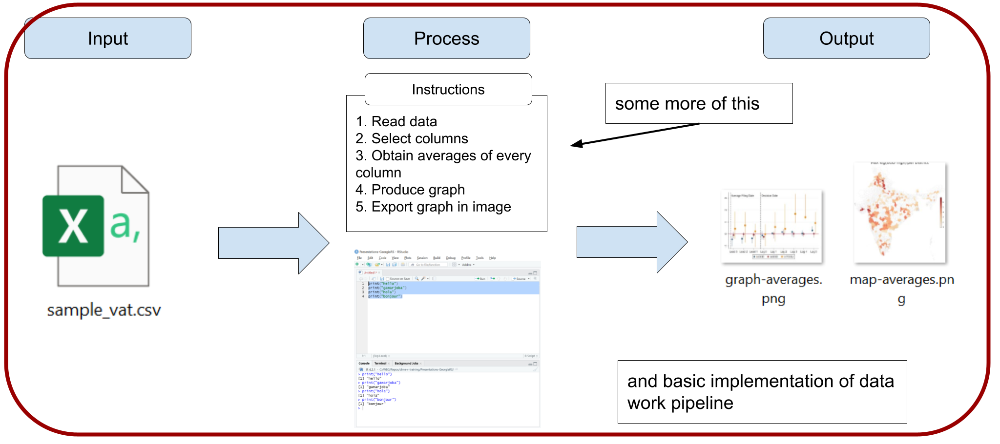
```

---

class: inverse, center, middle
name: bibliotecas-r

# Bibliotecas R

<html><div style='float:left'></div><hr color='#D38C28' size=1px width=1100px></html>
  
---

# Bibliotecas R

- Instalar o R no seu computador fornece acesso às suas funções básicas.
- Além disso, você pode instalar bibliotecas. Bibliotecas são pacotes de funções adicionais do R que permitem:
  + Executar operações que as funções básicas do R não fazem (exemplo: trabalhar com dados geográficos)
+ Realizar operações que o R básico faz, mas de forma mais fácil (exemplo: manipulação de dados)

---
  
# Bibliotecas R

Em resumo:

```{r echo = FALSE, out.width="90%"}
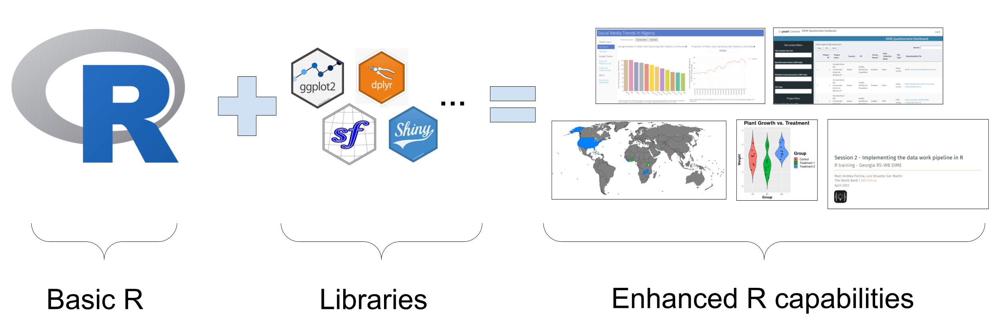
```

---
  
# Bibliotecas R

## Instalando bibliotecas R

+ A instalação de bibliotecas geralmente é simples, mas pode ser desafiadora em conexões institucionais, como no Banco Mundial ou na SEFAZ.

+ O próximo exercício configurará o RStudio para instalar bibliotecas sem problemas.

+ Nota: os pacotes já devem estar instalados nas suas máquinas

---
  
# Bibliotecas R

## Exercício 1: Configurar a instalação de bibliotecas

1. No RStudio, vá para `Tools` >> `Global Options...`

```{r echo = FALSE, out.width="60%"}
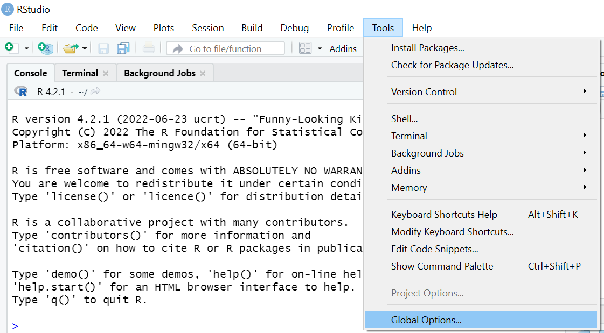
```

---
  
# Bibliotecas R

## Exercício 1: Configurar a instalação de bibliotecas

.pull-left[
  2. Selecione `Packages` no painel esquerdo.
  3. Desmarque `Use secure download method for HTTP`.
  4. Clique em `OK`.
  
  Você não verá nenhuma mudança na janela do RStudio, mas agora será possível instalar bibliotecas sem problemas.
]

.pull-right[
```{r echo = FALSE, out.width="90%"}
  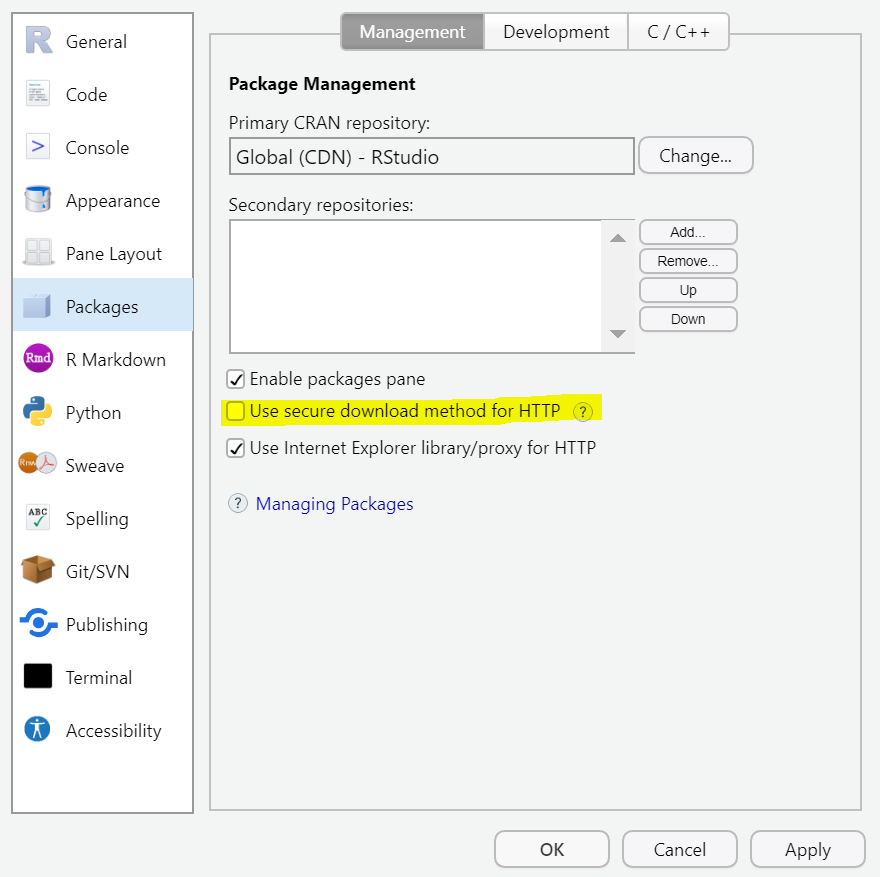
```
]

---
  
# Bibliotecas R

Utilizaremos a biblioteca `dplyr` na sessão de hoje.

## Exercício 2: Instalando bibliotecas

1. Instale a biblioteca com:
  
```{r eval=FALSE}
install.packages("dplyr")
```

- Note o uso de aspas (`" "`) nos nomes dos pacotes.
- **Digite este código no console**, não no script.

```{r echo = FALSE, out.width="50%"}
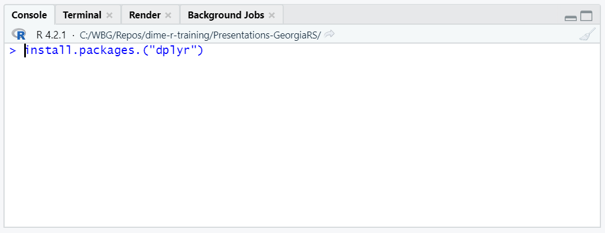
```

---
  
# Bibliotecas R

Agora que `dplyr` está instalado, precisamos carregá-lo para usar suas funções.

## Exercício 3: Carregar bibliotecas

.pull-left[
  1. Abra um novo script com `File` >> `New File` >> `R Script`.
  2. Carregue `dplyr` com:
    
```{r eval=FALSE}
  library(dplyr)
```
  
  - Execute este código no novo script aberto.
  - Note que **não utilizamos aspas** nos nomes das bibliotecas ao carregá-las.
]
.pull-right[
```{r echo = FALSE, out.width="90%"}
  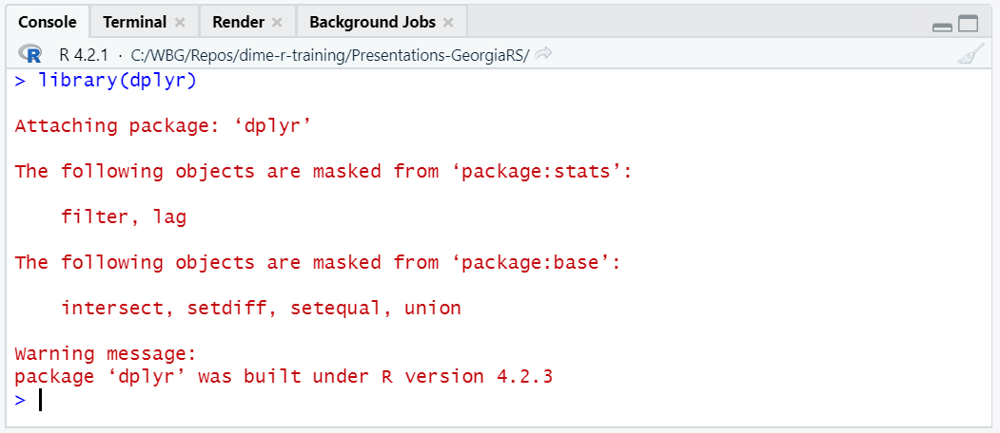
```
]

---
  
# Bibliotecas R // Bibliotecas R

- Instalação da biblioteca:

```{r echo = FALSE, out.width="37%"}

```

- Carregamento da biblioteca:
  
```{r echo = FALSE, out.width="37%"}

```

- Você instala as bibliotecas do R apenas uma vez no seu computador

- Você carrega as bibliotecas sempre que abre uma nova janela do RStudio (somente carregue as bibliotecas que usará)

---

class: inverse, center, middle
name: data-wrangling

# Manipulação de dados // Data Wrangling

<html><div style='float:left'></div><hr color='#D38C28' size=1px width=1100px></html>
  
---

# Manipulação de dados // Data Wrangling

## Preparando seus dados

- Os dados raramente estão em um formato pronto para serem convertidos diretamente em um resultado

- Em programação estatística, o processo de transformar dados em uma condição pronta para ser convertida em um resultado é chamado de **manipulação de dados**
  
```{r echo = FALSE, out.width="90%"}
knitr::include_graphics("img/session2/data-wrangling.png")
```

---
  
# Manipulação de dados // Data Wrangling

## Preparando seus dados

- A manipulação de dados é um dos aspectos mais cruciais e demorados do trabalho com dados

- Envolve não apenas a codificação, mas também o exercício mental de pensar qual deve ser a estrutura e condição do seu dataframe para produzir o resultado desejado

```{r echo = FALSE, out.width="90%"}
knitr::include_graphics("img/session2/data-wrangling-reasoning.png")
```

---
  
# Manipulação de dados // Data Wrangling

## Preparando seus dados

.pull-left[
  - Como mencionamos antes, usaremos `dplyr` e `tidyr` para manipulação de dados neste treinamento
  
  - Você também pode usar R básico, mas recomendamos essas bibliotecas porque suas funções são mais fáceis de usar
  
  - Num próximo passo, recomendo uso de `data.table` como ferramenta poderosa de análise de grandes bases
]
.pull-right[
  ```{r echo = FALSE, out.width="90%"}
  
  ```
]

---
  
# Manipulação de dados // Data Wrangling

## Exercício 4: Carregando dados

Esta parte é igual ao exercício que fizemos na sessão 1, mas não há problema em repeti-la para iniciar uma nova sessão do RStudio. **Se você tem o RStudio aberto, feche a janela e abra o RStudio novamente**.

.pull-left[
  1. Na sua nova janela do RStudio, vá para `File` > `Import Dataset` > `From Text (base)` e selecione novamente o arquivo `base_nfe.csv`
  
  + se você não sabe onde o arquivo está, verifique a pasta `Downloads`
  
  1. Certifique-se de selecionar `Heading` > `Yes` na próxima janela
  
  1. Selecione `Import`
  
  1. Faça o mesmo para o banco de dados `base_emissor.csv`
  
]
.pull-right[
  
```{r echo = FALSE, out.width="85%"}
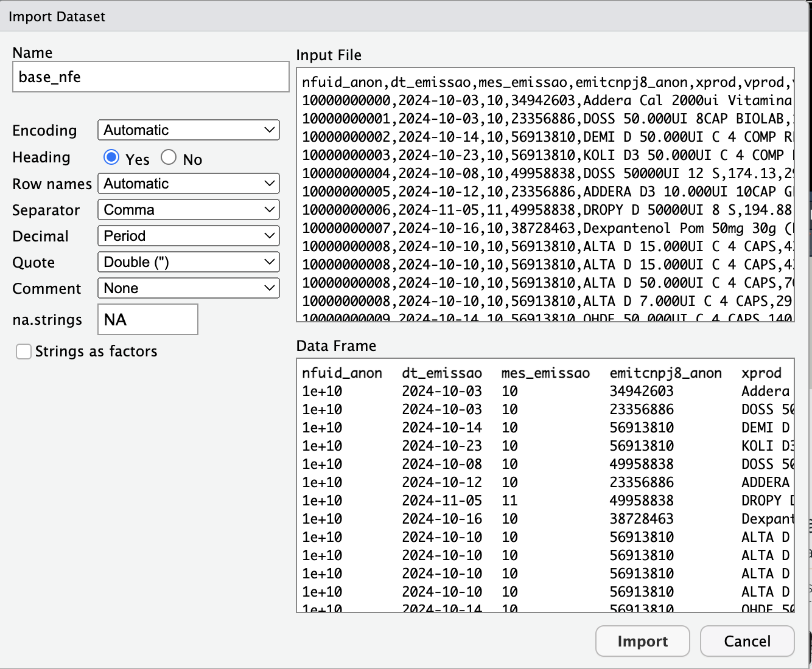
```
]

---
  
# Manipulação de dados // Data Wrangling

```{r, echo=FALSE}
base_nfe <- read.csv('/Users/tscot/Downloads/Treinamento_SEFAZ/base_nfe.csv')
base_emissor <- read.csv('/Users/tscot/Downloads/Treinamento_SEFAZ/base_emissor.csv')
```

```{r echo = FALSE, out.width="85%"}
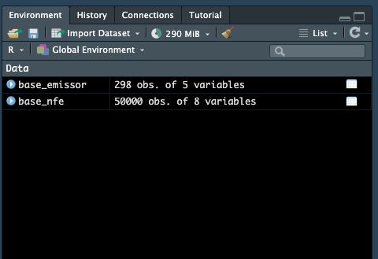
```

---
  
# Manipulação de dados // Data Wrangling

## Nota: carregando dados com uma função

- Você também pode carregar dados CSV com a função `read.csv()` ou `data.table::fread()` em vez de usar esse método manual

- O primeiro argumento de `read.csv()` ou `data.table::fread()` é o caminho no seu computador onde os dados estão localizados. Por exemplo:
  
```{r, eval=FALSE}
base_emissor <- read.csv("/Users/tscot/Downloads/Treinamento_SEFAZ/base_emissor.csv")
base_emissor <- fread('/Users/tscot/Downloads/Treinamento_SEFAZ/base_emissor.csv')
```

- Como sempre, você precisa armazenar o resultado da função em um objeto dataframe com o operador `<-` ou `=` para que ele seja salvo no ambiente

---
  
# Manipulação de dados // Data Wrangling

## Recapitulando: Conhecendo seus dados
  
- O dataframe `base_nfe` é o mesmo da sessão anterior, contendo informações ao nível de item da NFe
- O dataframe `base_emissor` é um dataframe no nível do emissor
- A coluna `emitcnpj8_anon` é um identificador anônimo do emissor e `emitxnomefantasia` é um nome aleatório
- A coluna `emituf` indica a unidade federativa do emissor

```{r echo = FALSE, out.width="60%"}
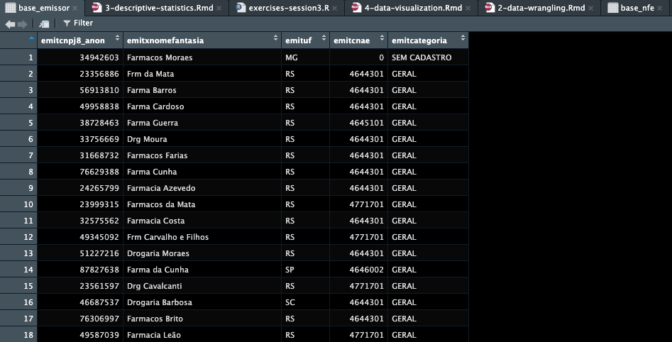
```

---
  
# Manipulação de dados // Data Wrangling

- Usaremos este dataframe apenas em um dos próximos exercícios, mas o carregamos agora porque é uma boa prática ter os dados carregados na memória para pronto uso

- Nos próximos exercícios, enfrentaremos cenários que nos mostrarão operações de manipulação de dados necessárias

---

class: inverse, center, middle
name: filtragem-classificacao

# Filtragem e classificação

<html><div style='float:left'></div><hr color='#D38C28' size=1px width=1100px></html>

---

# Filtragem e classificação

## Solicitação de trabalho com dados

**Cenário 1**: Imagine que você recebe a seguinte solicitação:

*"A Receita Estadual está investigando valores inconsistentes em NFes em dezembro. Gostaríamos que você extraísse os 50 maiores valores de itens para NFes emitidas em dezembro - você poderia produzir essa lista?"*

---

class: inverse, center, middle
name: filtragem-classificacao

# Filtragem e Classificação

<html><div style='float:left'></div><hr color='#D38C28' size=1px width=1100px></html>
  
---
  
# Filtragem e Classificação

## Solicitação de Trabalho com Dados

A manipulação dos dados aqui envolve várias operações:

1. Manter apenas as NFes de dezembro  
2. Ordenar pelos valores dos itens  
3. Manter apenas os 50 primeiros itens  

```{r echo = FALSE, out.width="95%"}
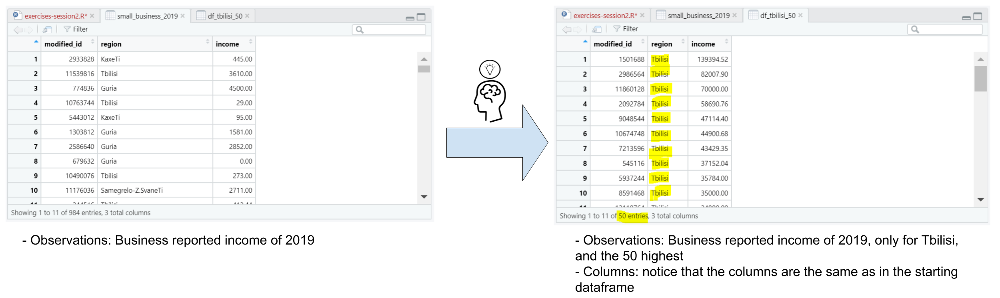
```

---
  
# Filtragem e Classificação

## 1. Manter apenas as NFes de dezembro  

Use `filter()` para isso:

```{r eval=FALSE}
temp1 <- filter(base_nfe, mes_emissao == 12)
```

```{r echo = FALSE, out.width="95%"}
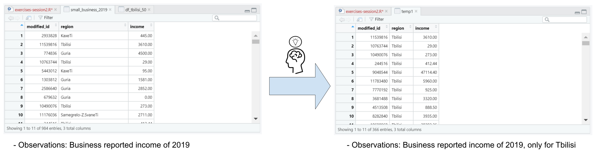
```

---
  
# Filtragem e Classificação

## 2. Ordenar pelos valores dos itens  

Use a função `arrange()` para ordenar. Por padrão, a ordenação no R é crescente. Incluímos o símbolo de menos (`-`) antes de `vprod` para ordenar de forma decrescente:

```{r eval=FALSE}
temp2 <- arrange(temp1, -vprod)
```

```{r echo = FALSE, out.width="95%"}
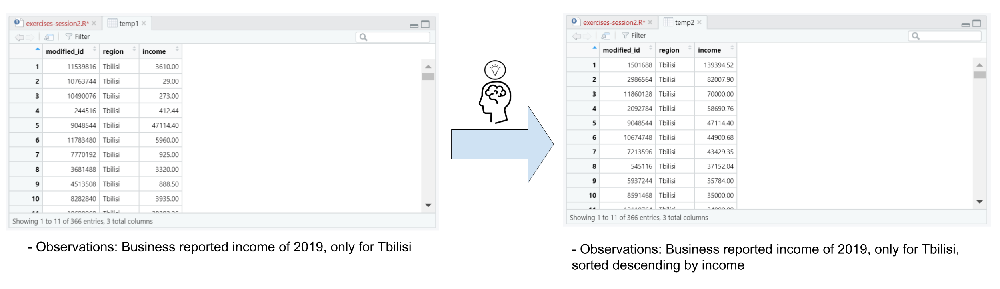
```

---
  
# Filtragem e Classificação

## 3. Manter apenas os 50 primeiros itens após a ordenação  

Use `filter()` novamente com o comando auxiliar `row_number()`

```{r eval=FALSE}
result_scenario1 <- filter(temp2, row_number() <= 50)
```

```{r echo = FALSE, out.width="95%"}
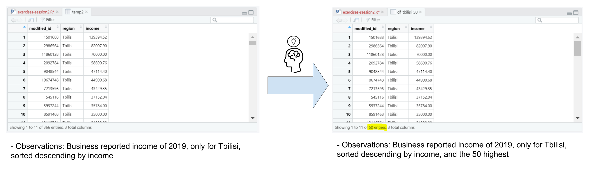
```

---
  
# Filtragem e Classificação

## Exercício 5: Filtre e classifique seus dados  

Agora que identificamos o formato do dataframe resultante e como obtê-lo, podemos escrever o código para isso.

1.- Seleção de linhas:
  
```{r eval=FALSE}
temp1 <- filter(base_nfe, mes_emissao == 10)
```

2.- Ordenação decrescente pelo valor do produto:
  
```{r eval=FALSE}
temp2 <- arrange(temp1, -vprod)
```

3.- Manter apenas os 50 primeiros itens:
  
```{r eval=FALSE}
result_scenario1 <- filter(temp2, row_number() <= 50)
```

---
  
# Filtragem e Classificação

## Algumas notas:

.pull-left[
  - `filter()`, `arrange()`, e `row_number()` são funções do `dplyr`. Lembre-se de carregar `dplyr` primeiro com `library(dplyr)`
  - Criamos dois dataframes intermediários: `temp1` e `temp2`
  - Podemos evitar isso usando o operador pipe (`%>%`), muito comum no R, mas não abordado nesta sessão  
  - O dataframe resultante é `result_scenario1`
]
.pull-right[
  ```{r echo = FALSE, out.width="95%"}
  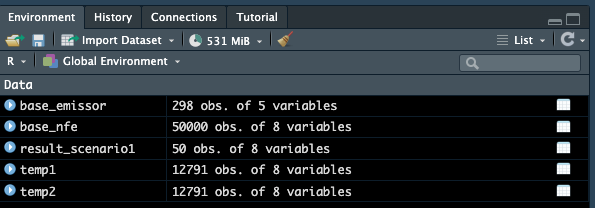
  ```
]

---
  
# Filtragem e Classificação

Você pode verificar o resultado com `View(result_scenario1)`. Agora este dataframe contém exatamente o que precisávamos!

```{r echo = FALSE, out.width="70%"}
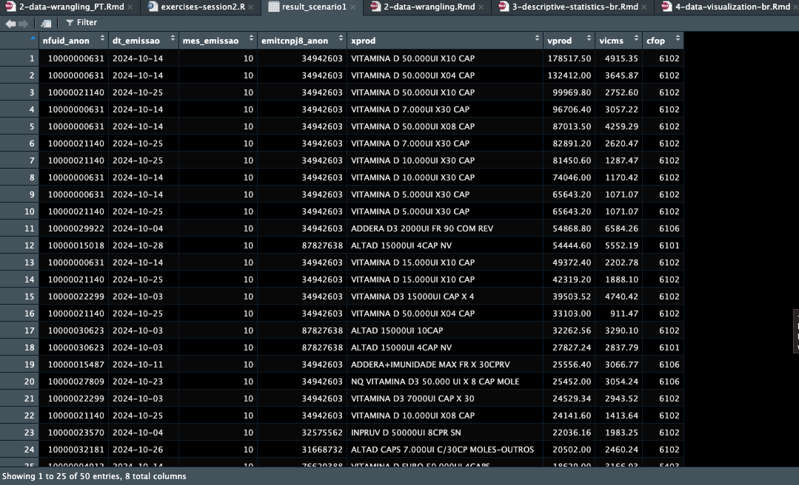
```

---
  
# Filtragem e Classificação

- Filtragem e classificação são operações comuns na manipulação de dados no R  
- Agora veremos uma nova operação muito útil: **junção de dados** (merging)

---

class: inverse, center, middle
name: merging

# Junção de Dataframes

<html><div style='float:left'></div><hr color='#D38C28' size=1px width=1100px></html>
  
---

# Junção de Dataframes

- Exploraremos mais uma operação comum na manipulação de dados: junção  
- A junção de dados é usada para combinar colunas de um dataframe com outro  
- Para isso, utilizamos uma "chave" que identifica as mesmas unidades nos diferentes dataframes  

```{r echo = FALSE, out.width="80%"}
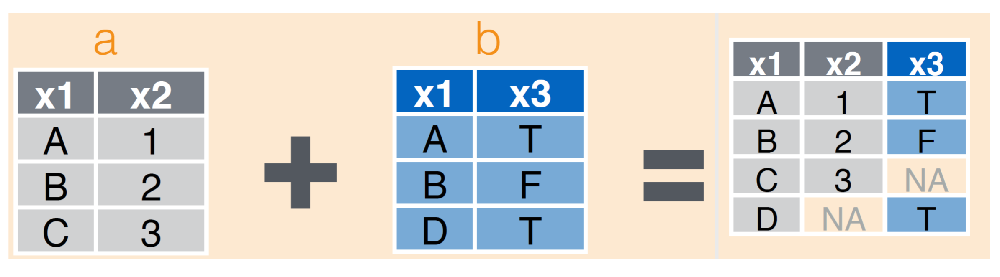
```

*Nota: Imagem retirada do guia de manipulação de dados do RStudio.*


---

# Junção de Dataframes

## Pedido de Análise de dados

**Cenário 2:**

*"Nós precisamos do valor total de ICMS das NFes somente pra emissores de fora do Estado. Você talvez queira utilizar a nova base de dados no nível do emissor para este exercício"*


---

# Junção de Dataframes

## Pedido de Análise de dados

Esses são os passos que precisamos seguir:

1. Selecionar as variaveis relevantes da `base_nfe`
1. Juntar as bases de dados
1. Filtrar somente emissores de fora do RS
1. Calcular o valor total de ICMS dessas notas

---

# Junção de Dataframes

## 1. Selecionar as variaveis relevantes da `base_nfe`

Use `select()` pra esse passo:

```{r eval=FALSE}
temp1 <- select(base_nfe, nfuid_anon, emitcnpj8_anon, vicms)
```

```{r echo = FALSE, out.width="80%"}
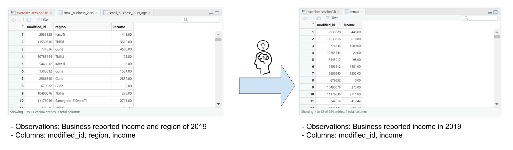
```

---

# Junção de Dataframes

## 2. Juntar as bases de dados

Use `left_join()` pra juntar as bases:

```{r eval=FALSE}
temp2 <- left_join(temp1, base_emissor, by = "emitcnpj8_anon")
```

- Os dois primeiros argumentos são as bases que queremos juntar
- O terceiro argumento (com um nome) é a variável-chave que conecta as bases

```{r echo = FALSE, out.width="55%"}
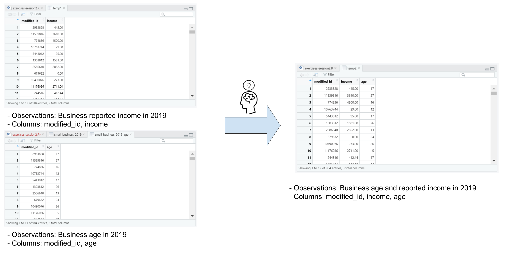
```

---

# Junção de Dataframes

## 3. Filtrar somente emissores de fora do RS

Use `filter()` outra vez:

```{r eval=FALSE}
temp3 <- filter(temp2, emituf != "RS")
```

```{r echo = FALSE, out.width="80%"}
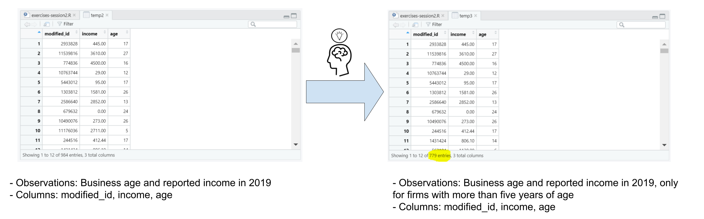
```

---

# Junção de Dataframes

## 4. Calcular o valor total de ICMS dessas notas

Use `summarise()` e `sum()`.

- `summarise()` nos permite agregar os dados usando uma função; nesse caso a soma (`sum()`)

```{r eval=FALSE}
total_income <- summarise(temp3, sum(vicms))
```


```{r echo = FALSE, out.width="80%"}
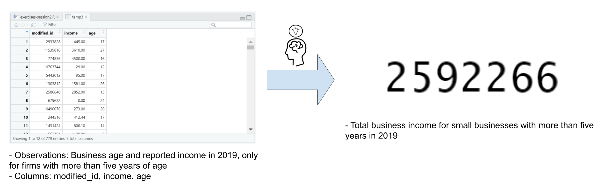
```

---

# Junção de Dataframes

## Exercício 6: Juntando as bases de dados

Aplique os passos discutidos anteriormente pra calcular o valor total de ICMS nas NFes emitidas fora do RS

1. Selecionar as variaveis relevantes da `base_nfe`

```{r eval=FALSE}
temp1 <- select(base_nfe, nfuid_anon, emitcnpj8_anon, vicms)
```

2.- Juntar as bases de dados

```{r eval=FALSE}
temp2 <- left_join(temp1, base_emissor, by = "emitcnpj8_anon")
```

3.- Filtrar somente emissores de fora do RS

```{r eval=FALSE}
temp3 <- filter(temp2, emituf != "RS")
```

4. Calcular o valor total de ICMS dessas notas

```{r eval=FALSE}
total_income <- summarise(temp3, sum(vicms))
```

---

# Junção de Dataframes

`total_income` é uma base de dados com uma observação e o valor que buscamos

```{r echo=FALSE}
temp1 <- select(base_nfe, nfuid_anon, emitcnpj8_anon, vicms)
temp2 <- left_join(temp1, base_emissor, by = "emitcnpj8_anon")
temp3 <- filter(temp2, emituf != "RS")
total_income <- summarise(temp3, sum(vicms))
```

```{r}
print(total_income)
```

---

# Junção de Dataframes

Esse foram alguns exemplos de como limpar dados. Outras operações comuns incluem:

| Operação | Função no `dplyr` |
| --------- | ---------------- |
| Selecionar colunas | `select()` |
| Filtrar linhas (com base em uma condição) | `filter()` |
| Criar novas colunas | `mutate()` |
| Criar novas colunas com base em uma condição | `mutate()` e `case_when()` |
| Adicionar novas linhas | `add_row()` |
| Mesclar dataframes | `inner_join()`, `left_join()`, `right_join()`, `full_join()` |
| Empilhar dataframes | `bind_rows()` |
| Remover duplicatas | `distinct()` |
| Agrupar e criar indicadores resumidos | `group_by()`, `summarize()` |
| Passar um resultado como primeiro argumento para a próxima função | `%>%` (operador, não função) |


---

class: inverse, center, middle
name: exporting-outputs

# Exportando resultados

<html><div style='float:left'></div><hr color='#D38C28' size=1px width=1100px></html>


---

# Exportando resultados

- Até agora, vimos exemplos das partes 1 e 2 do trabalho com dados
- E como exportar resultados?

```{r echo = FALSE, out.width="90%"}
knitr::include_graphics("img/session2/data-work-progress.png")
```

- Vamos ver no próximo exercício

---

# Exportando resultados

## Exportando dataframes

- A maneira mais fácil de exportar um dataframe ou número é com a função `write.csv()`

- `write.csv()` cria um arquivo CSV com o dataframe

- Ele recebe dois argumentos básicos:

  1. O nome do objeto que você deseja exportar
  1. Um caminho de arquivo para exportar o objeto

- `write.csv()` inclui os números das linhas por padrão. Você pode adicionar o argumento `row.names = FALSE` para evitar isso

---

# Exportando resultados

## Exercício 7: Exporte `result_scenario1` e `total_income`

1. Use este código para exportar os resultados dos dois últimos exercícios:

```{r eval=FALSE}
write.csv(result_scenario1,
          "result_scenario1.csv",
          row.names = FALSE)

write.csv(total_income,
          "total_income.csv",
          row.names = FALSE)
```

---

# Exportando resultados

Agora `result_scenario1.csv` e `total_income.csv` devem aparecer no seu computados (provavelmente no folder `Documents`).

```{r echo = FALSE, out.width="70%"}
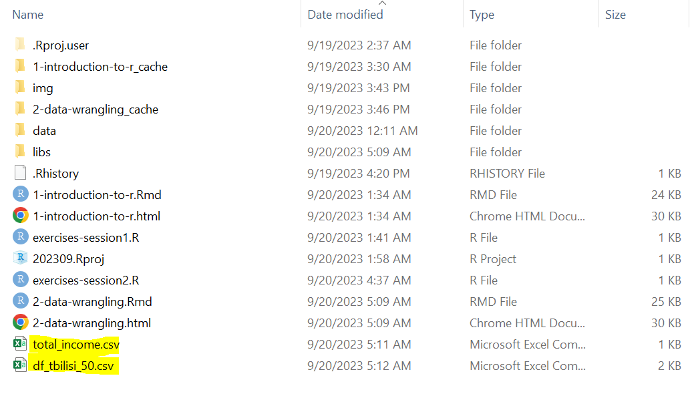
```

---

# Exportando resultados

## Comentários sobre caminhos (*paths*)

- O segundo argumento de `write.csv()` especifica o caminho do arquivo que vamos exportar

```{r eval=FALSE}
write.csv(result_scenario1,
          "result_scenario1.csv",
          row.names = FALSE)
```

- Você pode incluir qualquer caminho no seu computador e o R vai salvar nessa localização

  + Por exemplo: `"/Users/tscot/Downloads`" exporta os resultados pra pasta de *downloads* do meu computados (isso não funcionaria em outras máquinas)
  
  + Note que o caminho no R usa barra a direita (*forward slashes*) (`/`). Barra invertida (*back slash*) (`\`) **do not work in R**

---

# Exportando resultados

## Comentários sobre caminhos (*paths*)

```{r eval=FALSE}
write.csv(result_scenario1,
          "result_scenario1.csv",
          row.names = FALSE)
```

- Se você só incluir o nome do arquivo, R vai exportar pra localização atual do RStudio - normalmente o folder `Documents`

- Você pode checar a localização atual do RStudio com a função `getwd()`

---

# Exportando resultados

Nosso pipeline de dados agora está completo!!!

```{r echo = FALSE, out.width="70%"}
knitr::include_graphics("img/session2/data-work-final-table.png")
```

---

class: inverse, center, middle
name: finalizando

# Finalizando

<html><div style='float:left'></div><hr color='#D38C28' size=1px width=1100px></html>
  
---

# Finalizando

- Não se esqueça de salvar seu trabalho!  
- Utilize `#` para adicionar comentários no código  
- Salve seu arquivo em um local seguro  

```{r echo = FALSE, out.width="55%"}
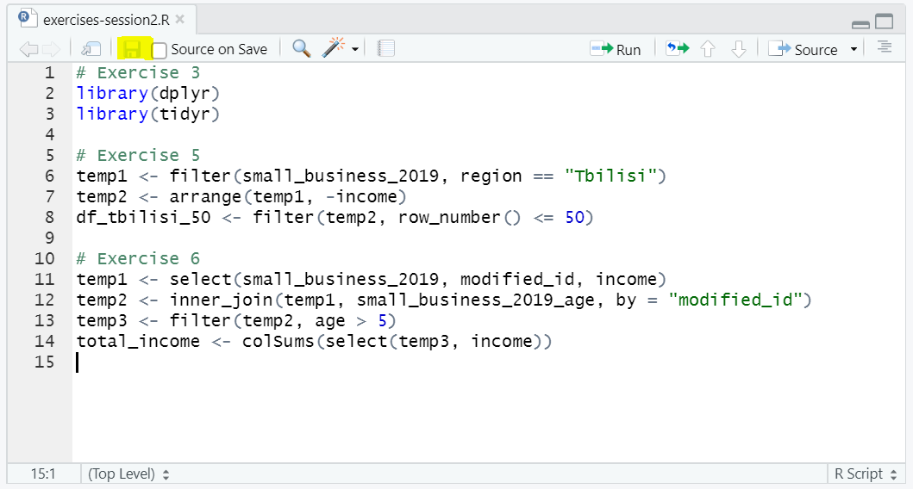
```

---
  
# Conclusão
  
- Exploramos operações essenciais de manipulação de dados  
- Aplicamos filtragem, ordenação, junção e exportação de resultados  
- Essas técnicas são fundamentais para análise de dados no R  

```{r echo = FALSE, out.width="85%"}
knitr::include_graphics("img/session2/data-work-final.png")
```

---
  
# Finalizando

## Pipeline de trabalho com dados

```{r echo = FALSE, out.width="85%"}
knitr::include_graphics("img/session2/data-work-day-2.png")
```

---

class: inverse, center, middle
name: apendice

# Apêndice

<html><div style='float:left'></div><hr color='#D38C28' size=1px width=1100px></html>

---

# Apêndice

## Agregação

**Cenário:** Imagine que você recebe a seguinte solicitação:

*"Estamos preparando um relatório onde queremos incluir o valor total e médio por produto. Você pode calcular esses números?"*

---

# Apêndice

## Agregação

A manipulação dos dados aqui envolve várias operações:

1. Manter apenas as colunas relevantes e descartar as demais  
2. Agrupar o dataframe por produto  
3. Calcular o valor total por produto  
4. Calcular o valor médio por produto  

A operação de transformar um dataframe com um nível mais baixo de observações (exemplo: NFE) para um nível agregado (exemplo: produto) é chamada de **agregação**.

---
  
# Apêndice

## 1. Manter apenas as colunas relevantes

Use `select()` para isso:

```{r eval=FALSE}
temp1 <- select(base_nfe, xprod, vprod)
```

---
  
# Apêndice

## 2. Agrupar por produto

Use `group_by()`:

```{r eval=FALSE}
temp2 <- group_by(temp1, xprod)
```

---
  
# Apêndice

## 3. Calcular as colunas agregadas: valor total e médio

Use `summarize()` combinado com `sum()` e `mean()`:

```{r eval=FALSE}
product_df <- summarize(temp2,
                        total = sum(vprod),
                        average = mean(vprod))
```

---
  
# Apêndice

## Exercício: Agregue seus dados

Agora podemos escrever o código para executar a agregação de dados.
1. Seleção de colunas: `temp1 <- select(base_nfe, xprod, vprod)`  
2. Agrupamento por produto: `temp2 <- group_by(temp1, xprod)`  
3. Cálculo do total e da média por produto:
  
```{r, eval=FALSE}
product_df <- summarize(temp2,
                        total = sum(vprod),
                        average = mean(vprod))
```

Algumas observações:
  
- Lembre-se de que todas essas funções fazem parte do `dplyr`  
- Há uma quebra de linha e um espaço de tabulação entre cada argumento de `summarize()`. Isso é utilizado para maior clareza no código, mas o R ignora essas quebras de linha e espaços quando usados entre os argumentos das funções  

---
  
# Apêndice

## Agregação

Você pode verificar o resultado com `View(product_df)`. Agora seus dados estão agregados exatamente como necessário!

```{r echo = FALSE, out.width="85%"}
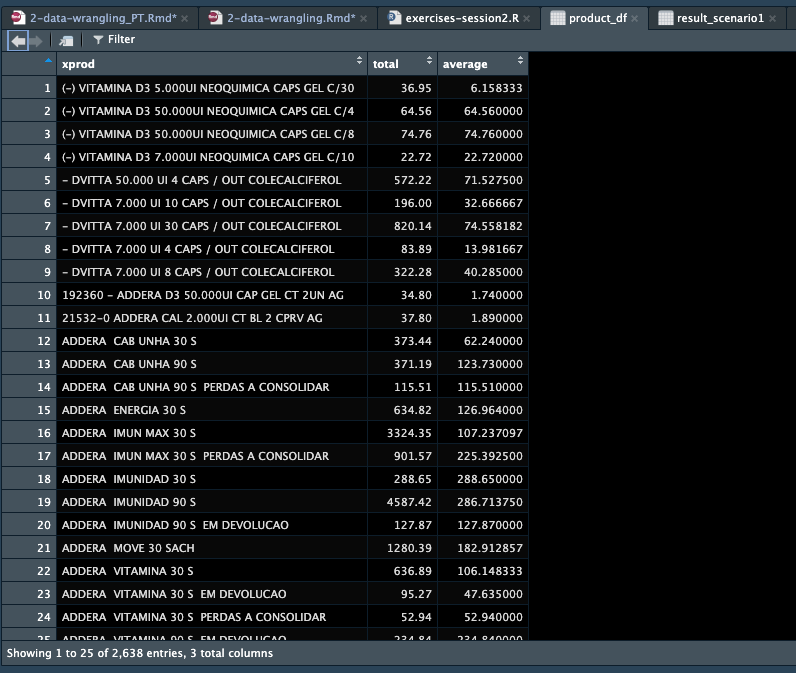
```