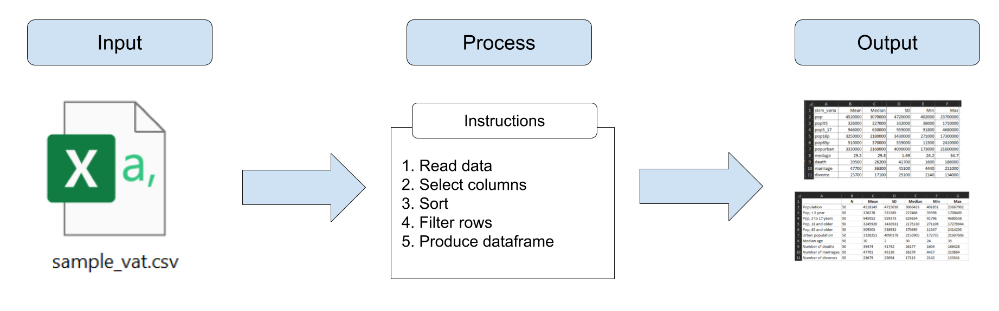
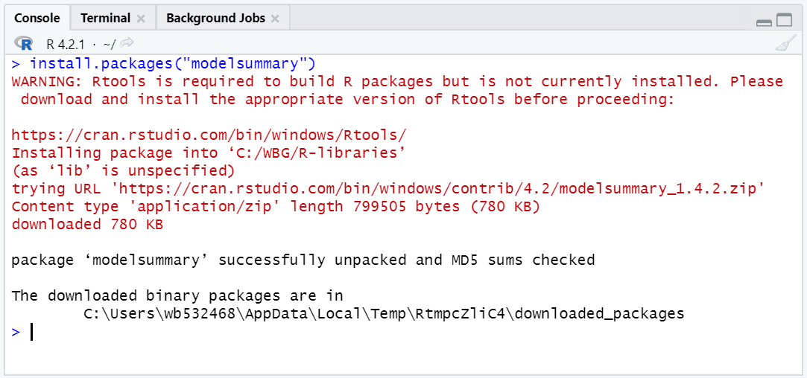
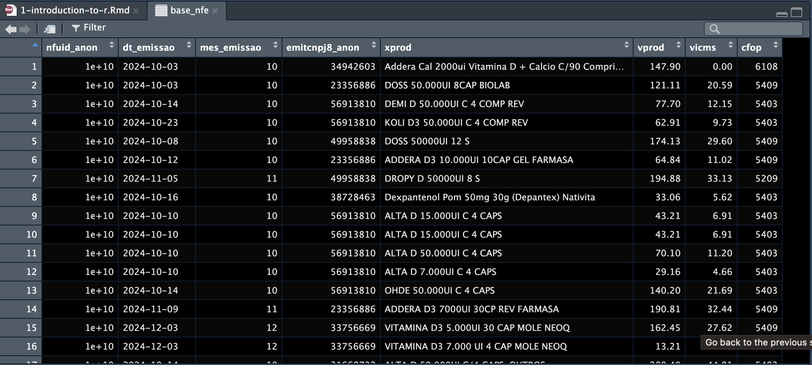
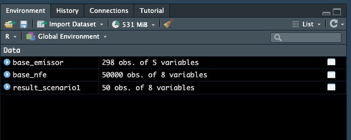
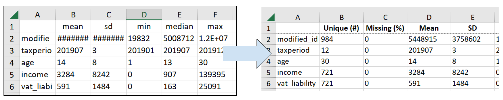
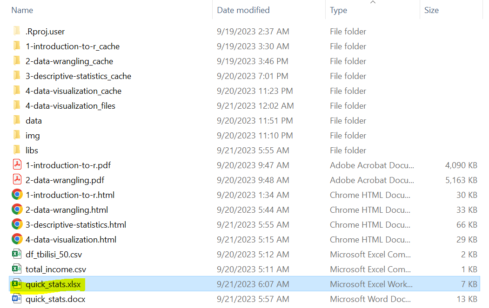
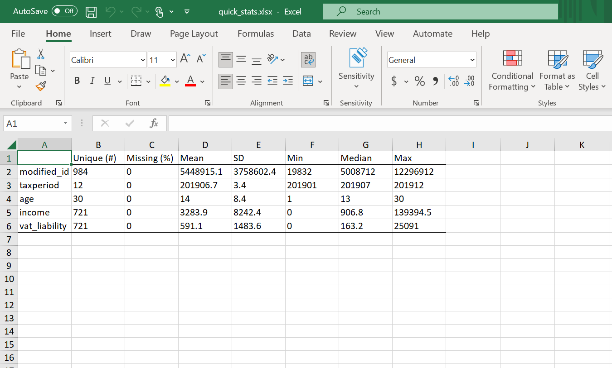
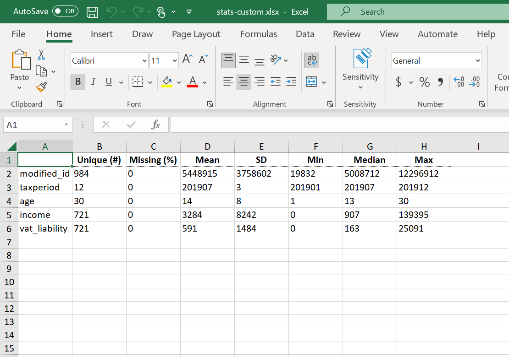
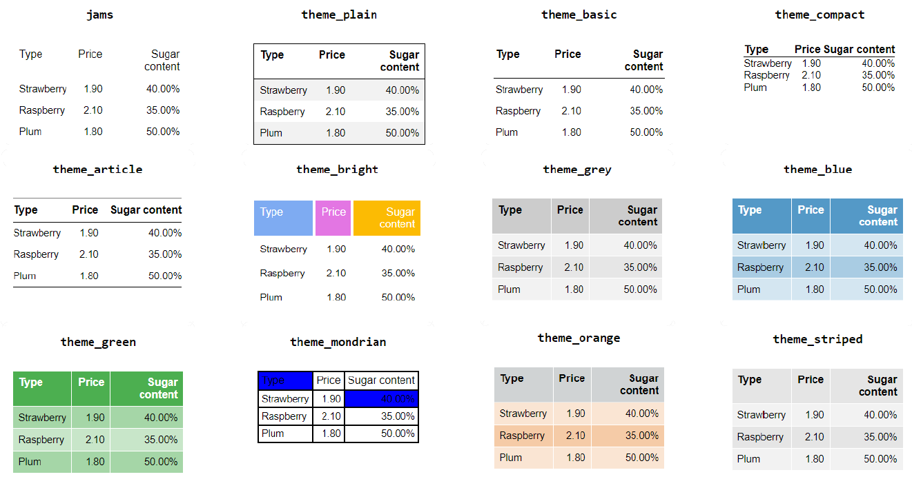
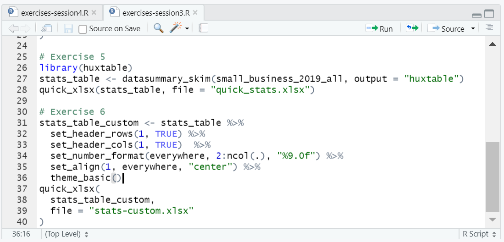

```{r setup, include = FALSE}
# Load packages
library(knitr)
library(xaringanExtra)
library(here)
library(dplyr)
library(modelsummary)
library(huxtable)
here::i_am("3-descriptive-statistics.Rmd")
options(htmltools.dir.version = FALSE)
opts_chunk$set(
  fig.align = "center",
  fig.height = 4,
  dpi = 300,
  cache = T
  )
xaringanExtra::use_panelset()
xaringanExtra::use_webcam()
xaringanExtra::use_clipboard()
htmltools::tagList(
  xaringanExtra::use_clipboard(
    success_text = "<i class=\"fa fa-check\" style=\"color: #90BE6D\"></i>",
    error_text = "<i class=\"fa fa-times-circle\" style=\"color: #F94144\"></i>"
  ),
  rmarkdown::html_dependency_font_awesome()
)
xaringanExtra::use_logo(
  image_url = here("img",
                   "lightbulb.png"),
  exclude_class = c("inverse", 
                    "hide_logo"),
  width = "50px"
)
```

```{css, echo = F, eval = T}
@media print {
  .has-continuation {
    display: block !important;
  }
}
```

# Índice

- [Introdução](#intro)
- [Piping](#piping)
- [Estatísticas resumidas rápidas](#quick-summary-stats)
- [Estatísticas resumidas personalizadas](#customized-summary-stats)
- [Exportando tabelas](#exporting-tables)
- [Personalizando saídas de tabelas](#customizing-table-outputs)
- [Conclusão](#wrapping-up)

---

class: inverse, center, middle
name: intro

# Introdução

<html><div style='float:left'></div><hr color='#D38C28' size=1px width=1100px></html>

---

# Introdução

- Ontem aprendemos como fazer programação estatística e exportar os resultados em arquivos `.csv`
- No entanto, às vezes precisamos de tabelas mais refinadas do que CSVs simples (e feios)

```{r echo = FALSE, out.width="95%"}

```

---

# Introdução

- É disso que trata a sessão de hoje, junto com uma explicação sobre os pipes (*encadeamento*) (`%>%`)

```{r echo = FALSE, out.width="95%"}

```

---

# Introdução

## Exercício 1a: Obtendo as bibliotecas para a sessão de hoje

Vamos usar duas bibliotecas R nesta sessão: `modelsummary` e `huxtable`.

1. Instale `modelsummary` e `huxtable`:

```{r eval=FALSE}
install.packages("modelsummary")
install.packages("huxtable")
```

```{r echo = FALSE, out.width="55%"}

```

---

# Introdução

## Exercício 1b: Carregue os dados que usaremos

```{r, eval=FALSE}
base_emissor <- read.csv("/Users/tscot/Downloads/Treinamento_SEFAZ/base_emissor.csv")
base_nfe <- read.csv('/Users/tscot/Downloads/Treinamento_SEFAZ/base_nfe.csv')
```

---

# Introdução

Você deve ter esses dois dataframes carregados no ambiente após isso.

```{r echo = FALSE, out.width="90%"}
knitr::include_graphics("img/session2/ex4-br.png")
```

---

# Introdução

## Recapitulação: sempre conheça seus dados!

```{r echo = FALSE, out.width="70%"}

```

---

class: inverse, center, middle
name: piping

# Piping

<html><div style='float:left'></div><hr color='#D38C28' size=1px width=1100px></html>

---

# Piping

- Antes de começarmos a produzir saídas mais refinadas, precisamos cobrir o piping (*encadeamento*)

- Você provavelmente se lembra deste código de um dos exercícios de ontem:

```{r eval= FALSE}
# Filtrar apenas NFes de dezembro:
temp1 <- filter(base_nfe, mes_emissao == 12)

# Ordenar resultado anterior por valor, ordem decrescente:
temp2 <- arrange(temp1, -vprod)

# Manter apenas os 50 primeiros itens após ordenação:
result_scenario1 <- filter(temp2, row_number() <= 50)
```

---

# Piping

Este código funciona, mas o problema é que é trabalhoso de escrever e nos faz gerar dataframes intermediários desnecessários (`temp1`, `temp2`) que armazenam resultados temporariamente

```{r echo = FALSE, out.width="75%"}
knitr::include_graphics("img/session3/temp_dfs.png")
```

---

# Piping

Em vez disso, podemos usar pipes para **passar os resultados de uma função e aplicar uma nova função em cima dela**

.pull-left[
```{r eval= FALSE}
# Filtrar apenas NFes de dezembro:
temp1 <- filter(base_nfe, mes_emissao == 12)

# Ordenar resultado anterior por valor, ordem decrescente:
temp2 <- arrange(temp1, -vprod)

# Manter apenas os 50 primeiros itens após ordenação:
result_scenario1 <- filter(temp2, row_number() <= 50)
```
]

.pull-right[
```{r eval=FALSE}
# O mesmo mas com pipes:
result_scenario1 <- base_nfe %>% 
  filter(mes_emissao == 12) %>%
  arrange(-vprod) %>%
  filter(row_number() <= 50)
```
]

---

# Piping


.pull-left[
```{r eval= FALSE}
# Filtrar apenas NFes de dezembro:
temp1 <- filter(base_nfe, mes_emissao == 12)

# Ordenar resultado anterior por valor, ordem decrescente:
temp2 <- arrange(temp1, -vprod)

# Manter apenas os 50 primeiros itens após ordenação:
result_scenario1 <- filter(temp2, row_number() <= 50)
```
]

.pull-right[
```{r eval=FALSE}
# O mesmo mas com pipes:
result_scenario1 <- base_nfe %>% 
  filter(mes_emissao == 12) %>%
  arrange(-vprod) %>%
  filter(row_number() <= 50)
```
]

Existem vários detalhes importantes para notar aqui:

1.- O dataframe resultante `result_scenario1` é **o mesmo em ambos os casos**

---

# Piping

.pull-left[
```{r eval= FALSE}
# Filtrar apenas NFes de dezembro:
temp1 <- filter(base_nfe, mes_emissao == 12)

# Ordenar resultado anterior por valor, ordem decrescente:
temp2 <- arrange(temp1, -vprod)

# Manter apenas os 50 primeiros itens após ordenação:
result_scenario1 <- filter(temp2, row_number() <= 50)
```
]

.pull-right[
```{r eval=FALSE}
# O mesmo mas com pipes:
result_scenario1 <- base_nfe %>% 
  filter(mes_emissao == 12) %>%
  arrange(-vprod) %>%
  filter(row_number() <= 50)
```
]

2.- O nome do dataframe resultante agora é definido na primeira linha desta operação de manipulação de dados. Isso ocorre porque **o R avalia linhas com pipes consecutivos como se fossem uma única linha**

---

# Piping

.pull-left[
```{r eval= FALSE}
# Filtrar apenas NFes de dezembro:
temp1 <- filter(base_nfe, mes_emissao == 12)

# Ordenar resultado anterior por valor, ordem decrescente:
temp2 <- arrange(temp1, -vprod)

# Manter apenas os 50 primeiros itens após ordenação:
result_scenario1 <- filter(temp2, row_number() <= 50)
```
]

.pull-right[
```{r eval=FALSE}
# O mesmo mas com pipes:
result_scenario1 <- base_nfe %>% 
  filter(mes_emissao == 12) %>%
  arrange(-vprod) %>%
  filter(row_number() <= 50)
```
]

3.- Observe que as funções `arrange()` e `filter()` usadas após os pipes agora têm apenas **um argumento em vez de dois**. Isso ocorre porque ao usar pipes, o primeiro argumento é implicitamente o resultado da função antes dos pipes

---

# Piping

## Exercício 2: filtragem e ordenação revisitadas

1. Aplique a mesma filtragem e ordenação agora com pipes

```{r eval=FALSE}
result_scenario1 <- base_nfe %>% 
  filter(mes_emissao == 12) %>%
  arrange(-vprod) %>%
  filter(row_number() <= 50)
```


- **Atalho**: o RStudio reconhece o atalho `Crtl+Shift+M` para pipe (`%>%`)
---

# Piping

Agora não teremos nenhum resultado intermediário irritante armazenado em nosso ambiente!

.pull-left[
```{r eval=FALSE}
# O mesmo mas com pipes:
result_scenario1 <- base_nfe %>% 
  filter(mes_emissao == 12) %>%
  arrange(-vprod) %>%
  filter(row_number() <= 50)
```
]

.pull-right[
```{r echo = FALSE, out.width="85%"}

```
]

---

# Piping

## Sempre use pipes!

Agora que você conhece o poder dos pipes, use-os sabiamente!

.pull-left[
- Lembre-se que os pipes fazem parte da biblioteca `dplyr`, você precisa carregá-la antes de usá-los

- Os pipes também melhoram drasticamente a clareza do código

- Muitos programadores R usam pipes e exemplos da internet assumem que você os conhece

- **Usaremos pipes agora nos próximos exemplos e exercícios do resto deste treinamento**
]

.pull-right[
```{r echo = FALSE, out.width="45%"}

```
]

---

class: inverse, center, middle
name: quick-summary-stats

# Estatísticas resumidas rápidas

<html><div style='float:left'></div><hr color='#D38C28' size=1px width=1100px></html>

---

# Estatísticas resumidas rápidas

Aprendemos ontem como produzir dataframes com resultados e exportá-los.

## Mas e se você quiser...?

- ...exportar resultados em um formato diferente (exemplo: Excel)

- ...personalizar ainda mais quais linhas e colunas exibir em um resultado

- ...formatar os resultados que você exporta

---

# Estatísticas resumidas rápidas

## Você precisará de `modelsummary` e `huxtable` para isso

- Essas bibliotecas permitem exportar resultados de forma personalizada

- Escolhemos uma combinação de ambas porque juntas exportam uma grande variedade de tipos de saída e permitem personalização detalhada das saídas

```{r echo = FALSE, out.width="95%"}

```

---

# Estatísticas resumidas rápidas

Começaremos apresentando a função `datasummary_skim()` do `modelsummary`

.command[
## `datasummary_skim(data, output, ...)`

 * **data:** o conjunto de dados a ser resumido, o único argumento obrigatório
 * **output:** o tipo de saída desejada
 * **... :** opções adicionais permitem personalização de formatação, como incluir notas e títulos
]

Por exemplo:

```{r, eval = F}
datasummary_skim(
  data,
  output = "default",
  type = "numeric",
  title = NULL,
  notes = NULL,
  ...
)
```

---

# Estatísticas resumidas rápidas

## Exercício 3: Calcular estatísticas resumidas rápidas

1. Carregue `modelsummary` com `library(modelsummary)`

1. Use `datasummary_skim()` para criar uma tabela de estatísticas descritivas para `base_nfe`

```{r echo=FALSE}
base_emissor <- read.csv("/Users/tscot/Downloads/Treinamento_SEFAZ/base_emissor.csv")
base_nfe <- read.csv('/Users/tscot/Downloads/Treinamento_SEFAZ/base_nfe.csv')
```

---

# Estatísticas resumidas rápidas

Você deve estar vendo este resultado no painel inferior direito do RStudio.

```{r echo=FALSE}
print(datasummary_skim(base_nfe))
```

---

# Estatísticas resumidas rápidas

- A maioria das funções do `modelsummary` resume apenas variáveis numéricas por padrão

- Para resumir variáveis categóricas, use o argumento `type = "categorical"`

```{r eval=FALSE}
datasummary_skim(base_emissor, type = "categorical")
```

---

# Estatísticas resumidas rápidas

```{r echo=FALSE}
print(datasummary_skim(base_emissor, type = "categorical"))
```

---

# Estatísticas resumidas rápidas

- `datasummary_skim()` é conveniente porque é rápido, fácil e mostra muitas informações

```{r echo = FALSE}
print(datasummary_skim(base_emissor, type = "categorical"))
```

- Mas e se quisermos personalizar o que mostrar? É aí que usamos `datasummary()` em vez disso, também da biblioteca `modelsummary`

---

class: inverse, center, middle
name: customized-summary-stats

# Estatísticas resumidas personalizadas

<html><div style='float:left'></div><hr color='#D38C28' size=1px width=1100px></html>

---

# Estatísticas resumidas personalizadas

`datasummary()` é muito similar a `data_summary_skim()`. A única diferença é que requer um **argumento de fórmula**.

.command[
## `datasummary(formula, data, output)`

 * **formula:** uma fórmula de dois lados para descrever a tabela como: linhas ~ colunas
 * **data:** o conjunto de dados a ser resumido
 * **output:** o tipo de saída desejada
 * **... :** opções adicionais permitem personalização de formatação

]

```{r, eval = F}
datasummary(
  var1 + var2 + var3 ~ stat1 + stat2 + stat3 + stat4,
  data = data
)
```

---

# Estatísticas resumidas personalizadas

## Exercício 4: 

Crie uma tabela de estatísticas resumidas mostrando o número de observações, média, desvio padrão, mínimo e máximo para as variáveis `vprod`, `vicms` do dataframe `base_nfe`

1. Use `datasummary()` para isso:

```{r eval=FALSE}
datasummary(
  vprod + vicms ~ N + Mean + SD + Min + Max,
  base_nfe
)
```

---

# Estatísticas resumidas personalizadas

```{r echo=FALSE}
print(datasummary(
  vprod + vicms ~ N + Mean + SD + Min + Max,
  base_nfe
))
```

---

# Estatísticas resumidas personalizadas

```{r eval=FALSE}
datasummary(
 vprod + vicms ~ N + Mean + SD + Min + Max,  # esta é a fórmula
  base_nfe                                   # estes são os dados
)
```

Algumas observações:

- Os argumentos **formula** e **data** são obrigatórios para `datasummary()`
- Todos os outros argumentos são opcionais (como `title = *algum-título*`, para adicionar um título à tabela)
- A fórmula deve sempre ser definida como: linhas ~ colunas
- As linhas e colunas na fórmula são separadas por um sinal de mais (`+`)

---

# Estatísticas resumidas personalizadas

```{r eval=FALSE}
datasummary(
 vprod + vicms ~ N + Mean + SD + Min + Max,  # esta é a fórmula
  base_nfe                                   # estes são os dados
)
```

Nesse exercício utilizamos as estatísticas número de observações (`N`), média (`mean`), desvio-padrão (`SD`), mínimo (`Min`) e máximo (`Max`). Outras estatísticas incluem

| Estatística | Keyword |
| --------- | ------- |
|Mediana |`Median`|
|Percentile 25|`P25`|
|percentile 75|`P75`|
|Em geral: percentil XX| `PXX`|
|Histograma pequeno|`Histogram`|

---

class: inverse, center, middle
name: exporting-tables

# Exportando tabelas

<html><div style='float:left'></div><hr color='#D38C28' size=1px width=1100px></html>

---

# Exportando tabelas

Lembre-se que tanto `datasummary_skim()` quanto `datasummary()` têm um argumento opcional chamado *output*? Podemos usá-lo para especificar um caminho de arquivo para um arquivo de saída.

Por exemplo:

```{r eval=FALSE}
datasummary_skim(base_nfe,
                 output = "quick_stats.docx")
```

Irá exportar o resultado para a pasta `Documentos` (no Windows) em um arquivo Word chamado `quick_stats.docx`

---

# Exportando tabelas

O tipo de arquivo da saída é ditado pela extensão do arquivo. Por exemplo:

| Nome do arquivo | Extensão | Tipo de saída |
| --------- | -------------- | ----------- |
|"quick_stats.docx"|`.docx`|Word|
|"quick_stats.pptx"|`.pptx`|Power Point|
|"quick_stats.html"|`.html`|HTML (para abrir em um navegador)|
|"quick_stats.tex"|`.tex`|Latex|
|"quick_stats.md"|`.md`|Markdown|

Notou que está faltando Excel?

---

# Exportando tabelas

## Isso é porque as funções do `modelsummary` não podem exportar para Excel

- No entanto, podemos usar a biblioteca `huxtable` como intermediária para transformar resultados de funções `modelsummary` em arquivos Excel

- `huxtable` é um pacote para exportar tabelas em geral que permite **personalizar a saída que você está exportando**

- Vamos aprender como usá-lo no próximo exercício

---

# Exportando tabelas

## Exercício 5: Exportar uma tabela para Excel

1. Carregue `huxtable` com `library(huxtable)`

1. Execute o seguinte código para exportar o resultado de `datasummary_skim()` para Excel:

```{r eval=FALSE}
# Armazene a tabela em um novo objeto
stats_table <- datasummary_skim(base_nfe, output = "huxtable")

# Exporte este novo objeto para Excel com quick_xlsx()
quick_xlsx(stats_table, file = "quick_stats.xlsx")
```

---

# Exportando tabelas

Agora o resultado deve aparecer na pasta `Documents` 

```{r echo = FALSE, out.width="65%"}

```

---

# Exportando tabelas

E voce pode abrir no Excel e ajustar caso queira (**mas lembre-se dos objetivos de programação: reproducibilidade é afetada se fazemos ajustes manuais no Excel**)

```{r echo = FALSE, out.width="65%"}

```

---

# Exportando tabelas

```{r eval=FALSE}
# Armazene a tabela em um novo objeto
stats_table <- datasummary_skim(base_nfe, output = "huxtable")

# Exporte este novo objeto para Excel com quick_xlsx()
quick_xlsx(stats_table, file = "quick_stats.xlsx")
```

Alguns comentários sobre esse código:

- `quick_xlsx()` é uma função do pacote `huxtable`. O primeiro argumento é o objeto que queremos exports, e o segundo o nome do arquivo. Poderíamos também usar um caminho (`path`) pra indicar onde salvar o arquivo

- Note que utilizamos o argumento `output = "huxtable"` em `datasummary_skim()`. Isso indica ao R que o resultado deve ser um objeto que depois podemos utilizar com funções do `huxtable`, como `quick_xlsx()`

---

class: inverse, center, middle
name: customizing-table-outputs

# Personalizando saídas de tabelas

<html><div style='float:left'></div><hr color='#D38C28' size=1px width=1100px></html>

---

# Personalizando saídas de tabelas

O código abaixo mostra como a tabela `stats_table` pode ser formatada:

.pull-left[
```{r eval=FALSE}
# Começamos com stats_table:
stats_table %>%
  # Use primeira linha como cabeçalho da tabela
  set_header_rows(1, TRUE) %>%
  # Use primeira coluna como cabeçalho de linha
  set_header_cols(1, TRUE)  %>%
  # Não arredonde números grandes
  set_number_format(everywhere, 2:ncol(.), "%9.0f") %>%
  # Centralize células na primeira linha
  set_align(1, everywhere, "center") %>%
  # Defina um tema para formatação rápida
  theme_basic()
```
]

.pull-right[
.small[
```{r echo=FALSE, message=FALSE, warning=FALSE}
stats_table <- datasummary_skim(base_nfe, output = "huxtable")

# Formatar tabela
 stats_table %>%  
   set_header_rows(1, TRUE) %>%
   set_header_cols(1, TRUE)  %>%
   set_number_format(everywhere, 2:ncol(.), "%9.0f") %>%
   set_align(1, everywhere, "center") %>%
   theme_basic()
```
]
]

---

# Personalizando saídas de tabelas

## Exercício 6: Exportar uma tabela personalizada para Excel

.pull-left[
1.- Personalize `stats_table` em um novo objeto chamado `stats_table_custom`

```{r eval = FALSE}
stats_table_custom <- stats_table %>%
  # Use primeira linha como cabeçalho da tabela
  set_header_rows(1, TRUE) %>%
  # Use primeira coluna como cabeçalho de linha
  set_header_cols(1, TRUE)  %>%
  # Não arredonde números grandes
  set_number_format(everywhere, 2:ncol(.), "%9.0f") %>%
  # Centralize células na primeira linha
  set_align(1, everywhere, "center") %>%
  # Defina um tema para formatação rápida
  theme_basic()
```
]

.pull-right[
2.- Exporte `stats_table_custom` para um arquivo chamado `stats-custom.xlsx` com `quick_xlsx()`

```{r eval=FALSE}
quick_xlsx(
  stats_table_custom,
  file = "stats-custom.xlsx"
  )
```
]

---

# Customizing table outputs

```{r echo = FALSE, out.width="55%"}

```

---

# Customizing table outputs

Note que primeiro guardamos o resultado em um objeto...

```{r eval = FALSE}
stats_table_custom <- stats_table %>%  # <---- here
  set_header_rows(1, TRUE) %>%
  set_header_cols(1, TRUE)  %>%
  set_number_format(everywhere, 2:ncol(.), "%9.0f") %>%
  set_align(1, everywhere, "center") %>%
  theme_basic()
```

...que depois pode ser utilizado como argumento na função `quick_xslx()`

```{r eval=FALSE}
quick_xlsx(
  stats_table_custom,
  file = "stats-custom.xlsx"
  )
```

---

# Customizing table outputs

.pull-left[
**Before:**

```{r echo = FALSE, out.width="95%"}

```
]

.pull-right[
**After:**
```{r echo = FALSE, out.width="95%"}

```
]

---
# Personalizando saídas de tabelas

Usamos `theme_basic()` para dar um tema minimalista e básico à tabela. Outros temas disponíveis são:

```{r echo = FALSE, out.width="75%"}

```

---

class: inverse, center, middle
name: wrapping-up

# Conclusão

<html><div style='float:left'></div><hr color='#D38C28' size=1px width=1100px></html>

---

# Conclusão

## Salve seu trabalho!

Clique no disquete para salvar o script que você escreveu nesta sessão.

```{r echo = FALSE, out.width="55%"}

```

---

# Conclusão

## O que mais está disponível?

- Esta foi uma breve visão geral de como `modelsummary` e `huxtable` trabalham juntos para produzir saídas de tabela com aparência profissional em R

- Outras opções de formatação são: (todas do `huxtable`)

| Formatação | Comando |
|------------|---------|
|Exportar em novas abas do Excel em vez de novos arquivos|`as_Workbook()`|
|Mudar nomes de linhas|`add_rownames()`|
|Mudar nomes de colunas|`add_colnames()`|
|Células em negrito|`set_bold()`|
|Células em itálico|`set_italic()`|
|Tamanho da fonte da célula|`font_size()`|
|Cor da célula|`background_color()`|

---

# Conclusão

## O que mais está disponível?

Mais informações estão explicadas na documentação das bibliotecas:

  + Documentação do `modelsummary`: https://modelsummary.com/index.html
  + Documentação do `huxtable`: https://hughjonesd.github.io/huxtable/
  
---

# Conclusão

## Esta sessão

```{r echo = FALSE, out.width="95%"}

```

---

# Conclusão

## Próxima sessão (última)

```{r echo = FALSE, out.width="95%"}
knitr::include_graphics("img/session4/data-work-data-vis.png")
```

---

class: inverse, center, middle

# Obrigado!

<html><div style='float:left'></div><hr color='#D38C28' size=1px width=1100px></html>
