```{r setup, include = FALSE}
# Carregar pacotes
library(knitr)
library(xaringanExtra)
library(here)
library(ggplot2)
library(dplyr)
here::i_am("3-descriptive-statistics.Rmd")
options(htmltools.dir.version = FALSE)
opts_chunk$set(
  fig.align = "center",
  fig.height = 4,
  dpi = 300,
  cache = T
  )
xaringanExtra::use_panelset()
xaringanExtra::use_webcam()
xaringanExtra::use_clipboard()
htmltools::tagList(
  xaringanExtra::use_clipboard(
    success_text = "<i class=\"fa fa-check\" style=\"color: #90BE6D\"></i>",
    error_text = "<i class=\"fa fa-times-circle\" style=\"color: #F94144\"></i>"
  ),
  rmarkdown::html_dependency_font_awesome()
)
xaringanExtra::use_logo(
  image_url = here("img",
                   "lightbulb.png"),
  exclude_class = c("inverse", 
                    "hide_logo"),
  width = "50px"
)
```

```{css, echo = F, eval = T}
@media print {
  .has-continuation {
    display: block !important;
  }
}
```

# Índice

- [Introdução](#intro)
- [A gramática dos gráficos](#grammar-of-graphics)
- [Gráficos de barras](#bar-plots)
- [Gráficos de linha](#line-plots)
- [Codificações de texto](#text-encodings)
- [Gráficos de dispersão](#scatter-plots)
- [Conclusão](#wrapping-up)

---

class: inverse, center, middle
name: intro

# Introdução

<html><div style='float:left'></div><hr color='#D38C28' size=1px width=1100px></html>

---

# Introdução

## Sobre esta sessão

```{r echo = FALSE, out.width="80%"}
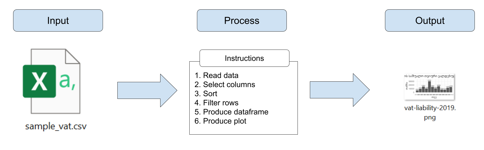
```

---

# Introdução

## Visualização de dados no pipeline de trabalho com dados

- Comparada a outros tipos de saídas, a visualização de dados envolve uma etapa extra após a manipulação de dados: produzir a visualização em si

- Também usamos código R para produzir visualizações de dados

- A entrada para esse código é um dataframe manipulado, um dataframe que está pronto para ser usado

```{r echo = FALSE, out.width="80%"}
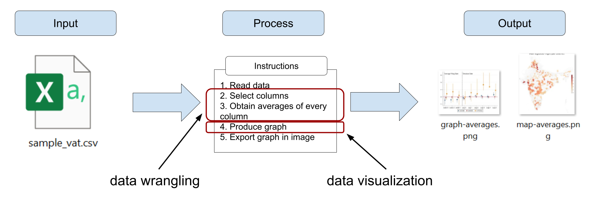
```

---

# Introdução

## Visualização de dados em R

.pull-left[
- Usaremos o pacote `ggplot2` para criar visualizações de dados

- O `ggplot2` facilita muito a produção de gráficos em R

  + Ele segue uma sintaxe baseada em uma descrição do gráfico que você quer obter
  
  + Esta sintaxe é chamada de **gramática dos gráficos**, um método de referência de definição de visualização de dados em programação estatística
]

.pull-right[
```{r echo = FALSE, out.width="70%"}
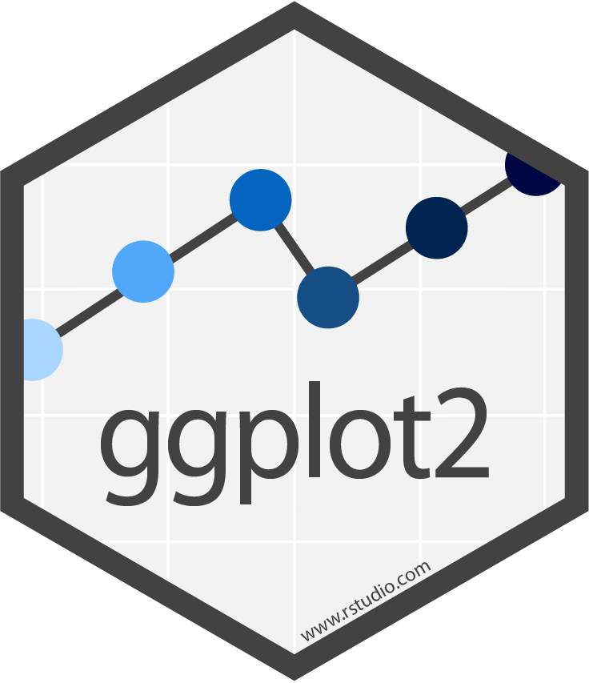
```
]

---

class: inverse, center, middle
name: grammar-of-graphics

# A gramática dos gráficos

<html><div style='float:left'></div><hr color='#D38C28' size=1px width=1100px></html>

---

# A gramática dos gráficos

## A gramática dos gráficos no `ggplot2`

```{r echo = FALSE, out.width="100%"}
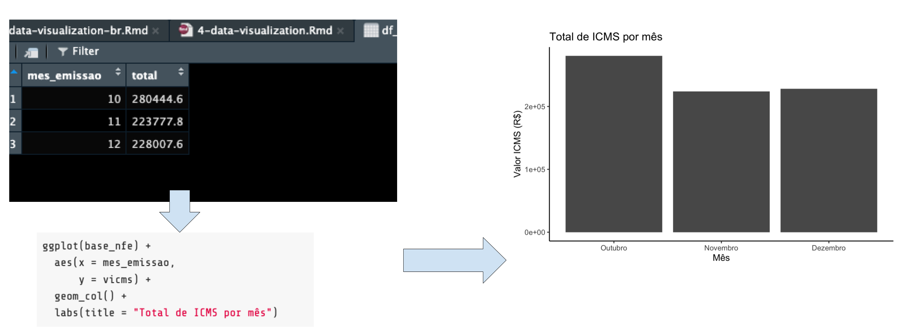
```

---

# A gramática dos gráficos

## A gramática dos gráficos no `ggplot2`

```{r echo = FALSE, out.width="100%"}
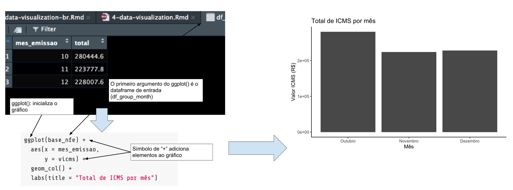
```

---

# A gramática dos gráficos

## A gramática dos gráficos no `ggplot2`

```{r echo = FALSE, out.width="100%"}
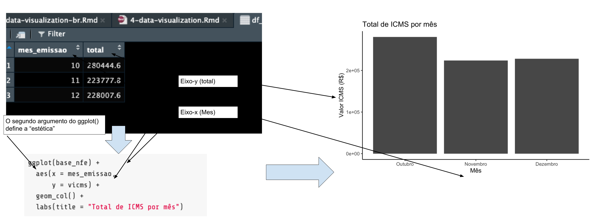
```

---

# A gramática dos gráficos

## A gramática dos gráficos no `ggplot2`

```{r echo = FALSE, out.width="100%"}
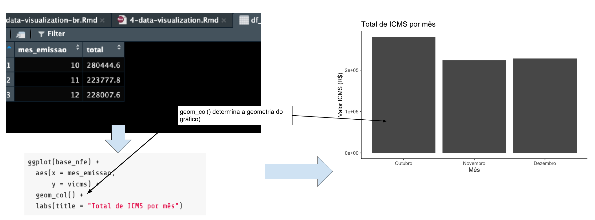
```

---

# A gramática dos gráficos

## A gramática dos gráficos no `ggplot2`

```{r echo = FALSE, out.width="100%"}
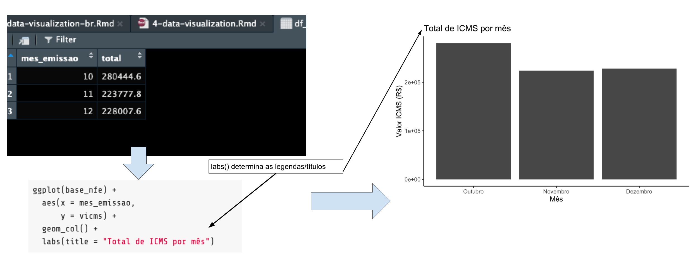
```

---

class: inverse, center, middle
name: bar-plots

# Gráficos de barras

<html><div style='float:left'></div><hr color='#D38C28' size=1px width=1100px></html>

---

# Gráficos de barras

## Exercício 1a: Criar um gráfico de barras básico

1. Abra um novo script para esta sessão clicando em `File` >> `New File` >> `R Script`

1. Carregue o `ggplot2`

```{r eval=FALSE}
library(ggplot2)
```

1. Produza um gráfico de barras básico com o seguinte código:

```{r eval = FALSE}
ggplot(base_nfe) +
  aes(x = mes_emissao,
      y = vicms) +
  geom_col() +
  labs(title = "Total de ICMS por mês")
```

---

# Gráficos de barras

```{r echo=FALSE}
base_nfe <- read.csv('/Users/tscot/Downloads/Treinamento_SEFAZ/base_nfe.csv')
```

Este resultado deve ser exibido no painel inferior direito da sua janela do RStudio

```{r echo=FALSE, out.width="70%"}
ggplot(base_nfe) +
  aes(x = mes_emissao,
      y = vicms) +
  geom_col() +
  labs(title = "Total de ICMS por mês")
```

---

# Gráficos de barras

Este gráfico parece aceitável, mas pode ser melhorado:

.pull-left[
- `mes_emissao` é uma variável que representa meses, mas o R não sabe disso e está mostrando simplesmente os números

- Podemos centralizar o título

- Devemos adicionar rótulos dos eixos (em vez de apenas "mes_emissao" e "vicms")

- Muita informação no fundo: cor cinza, linhas
]

.pull-right[
```{r echo=FALSE, out.width="100%"}
ggplot(base_nfe) +
  aes(x = mes_emissao,
      y = vicms) +
  geom_col() +
  labs(title = "Total de ICMS por mês")
```
]

---

# Gráficos de barras

## Exercício 1b: Melhore seu gráfico de barras

1. Use o seguinte código para melhorar a estética do seu gráfico

```{r eval=FALSE}
ggplot(base_nfe) +
  aes(x = as.factor(mes_emissao),    #as.factor() informa que mes_emissao não é número mas categorias
      y = vicms) +
  geom_col() +
  labs(title = "Total de ICMS por mês",
       # título do eixo x
       x = "Mês",
       # título do eixo y
       y = "Valor ICMS (R$)") +
  # dizendo ao R para não quebrar o eixo x
  scale_x_discrete(labels = c("Outubro", "Novembro", "Dezembro")) +
  # remove linhas de fundo e cor
  theme_classic() + 
  # centralizando o título do gráfico
  theme(plot.title = element_text(hjust = 0.5))
```

---

# Gráficos de barras

Agora está melhor:

```{r echo=FALSE, out.width="70%"}
ggplot(base_nfe) +
  aes(x = as.factor(mes_emissao),
      y = vicms) +
  geom_col() +
  labs(title = "Total de ICMS por mês",
       x = "Mês",
       y = "Valor ICMS (R$)") +
  scale_x_discrete(labels = c("Outubro", "Novembro", "Dezembro")) +
  theme_classic() + 
  theme(plot.title = element_text(hjust = 0.5)) 
  
```

---

# Gráficos de barras

## Exercício 1c: salve seu gráfico

Agora que seu gráfico está bom, você pode salvá-lo em uma saída com `ggsave()`

1. Use este código para salvar seu gráfico:

```{r eval = FALSE}
ggsave("base_nfe_totals.png",
       width = 20,
       height = 10,
       units = "cm")
```

---

# Gráficos de barras

.pull-left[
- `ggsave()` por padrão salva o último gráfico que você produziu

- O primeiro argumento em `ggsave()` é o nome do arquivo em que salvamos o gráfico. Também podemos usar caminhos de arquivo aqui

- O resto são argumentos opcionais que definem as dimensões da imagem que você exporta, é melhor defini-los para que a imagem tenha as proporções e tamanho de texto corretos
]

.pull-right[
```{r echo = FALSE, out.width="95%"}
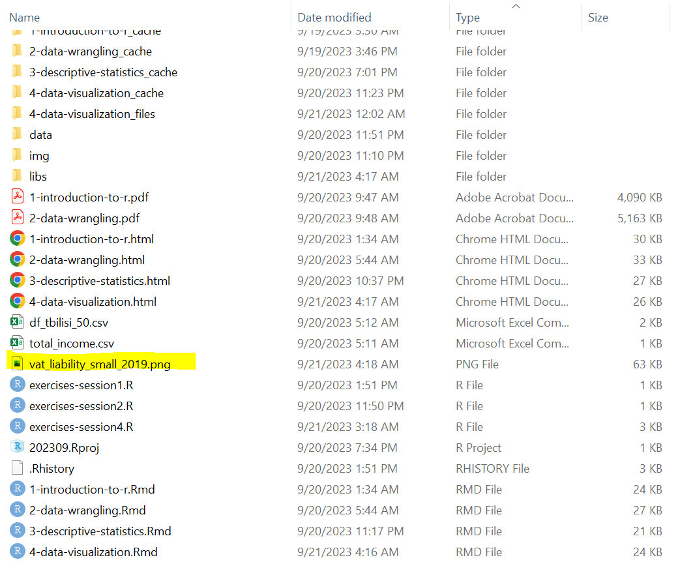
```
]

---

# Gráficos de barras

## Uma nota sobre sintaxe

- A visualização de dados geralmente requer várias iterações para adicionar novos elementos ao seu código inicial e melhorar seu gráfico

- `ggplot2` adiciona novos elementos a uma visualização com o símbolo `+`

- Mais personalização significa que seu código pode facilmente se tornar bastante longo. Usar espaços e quebras de linha ajuda na clareza, mas **simplesmente não há como evitar isso**

.pull-left[
.small[
```{r eval = FALSE}
# Exercício 1:
ggplot(base_nfe) +
  aes(x = mes_emissao,
      y = vicms) +
  geom_col() +
  labs(title = "Total de ICMS de pequenas empresas em 2019 por mês")
```
]
]

.pull-right[
.small[
```{r eval=FALSE}
# Exercício 2
ggplot(base_nfe) +
  aes(x = as.factor(mes_emissao),   
      y = vicms) +
  geom_col() +
  labs(title = "Total de ICMS por mês",
       x = "Mês",
       y = "Valor ICMS (R$)") +
  scale_x_discrete(labels = c("Outubro", "Novembro", "Dezembro")) +
  theme(plot.title = element_text(hjust = 0.5)) + 
  theme_classic()
```
]
]

---

class: inverse, center, middle
name: line-plots

# Gráficos de linha

<html><div style='float:left'></div><hr color='#D38C28' size=1px width=1100px></html>

---

# Gráficos de linha

- Em visualização de dados, chamamos de **codificações** a geometria selecionada para representar os dados visualmente

- Nos exemplos anteriores, fizemos isso quando usamos `geom_col()`. Isso diz ao R que nossa codificação para representar os dados são **barras** (também chamadas de colunas)

- `ggplot2` tem várias opções diferentes para codificações em visualização de dados, por exemplo: **linhas**

- A codificação para linhas no `ggplot2` é `geom_line()`

```{r echo=FALSE, warning=FALSE, message=FALSE}
df_group_month <- base_nfe %>%
  filter(emitcnpj8_anon %in% c(34942603, 23356886,33756669)) %>% 
  select(emitcnpj8_anon, mes_emissao, vicms) %>%
  group_by(emitcnpj8_anon, mes_emissao) %>%
  summarize(total = sum(vicms)) %>% 
  ungroup()
```

```{r echo=FALSE, out.width="55%"}
ggplot(df_group_month) +
  aes(x = mes_emissao,
      y = total) +
  geom_line(aes(color = as.factor(emitcnpj8_anon))) +
  labs(title = "Total de ICMS por grupo de empresas em 2019",
       x = "Mês",
       y = "ICMS (R$)") +
  scale_x_continuous(breaks = c(10,11,12)) +
  theme(plot.title = element_text(hjust = 0.5)) + 
  theme_classic()
```

---

# Gráficos de linha

- No entanto, eles geralmente também requerem alguma manipulação adicional de dados em comparação com gráficos de barras: os dados devem ser agrupados no nível especificado no eixo x e variável de agrupamento

- Isso ficará mais claro no próximo exercício. O gráfico que produziremos está abaixo

```{r echo=FALSE, out.width="65%"}
ggplot(df_group_month) +
  aes(x = mes_emissao,
      y = total) +
  geom_line(aes(color = as.factor(emitcnpj8_anon))) +
  labs(title = "Total de ICMS por grupo de empresas em 2019",
       x = "Mês",
       y = "ICMS (R$)") +
  scale_x_continuous(breaks = c(10,11,12)) +
  theme(plot.title = element_text(hjust = 0.5)) + 
  theme_classic()
```

---

# Gráficos de linha

## Exercício 2a: Agrupe seus dados no nível mês-grupo

Use o seguinte código para criar um dataframe agrupado no nível mês-emissor e calcular o ICMS total para cada emissor em cada mês

```{r eval = FALSE}
df_group_month <- base_nfe %>%
  filter(emitcnpj8_anon %in% c(34942603, 23356886,33756669)) %>% 
  select(emitcnpj8_anon, mes_emissao, vicms) %>%
  group_by(emitcnpj8_anon, mes_emissao) %>%
  summarize(total = sum(vicms)) %>% 
  ungroup()
```

---

# Gráficos de linha

.pull-left[
O resultado se parecerá com isso, você pode explorá-lo com `View(df_group_month)`.
]

.pull-right[
```{r echo = FALSE, out.width="85%"}
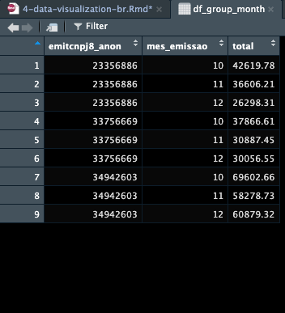
```
]

---

# Gráficos de linha

## Exercício 2b: Criar um gráfico de linha do ICMS por mês e grupo

```{r eval=FALSE}
ggplot(df_group_month) +
  aes(x = mes_emissao,
      y = total) +
  geom_line(aes(color = as.factor(emitcnpj8_anon))) +
  labs(title = "Total de ICMS por empresa-mes",
       x = "Mês",
       y = "ICMS (R$)") +
  scale_x_continuous(breaks = c(10,11,12)) +
  theme(plot.title = element_text(hjust = 0.5)) + 
  theme_classic()
```

---

# Gráficos de linha

Seu resultado possivelmente se parece com isso:

```{r echo=FALSE, warning=FALSE, message=FALSE, out.width="75%"}
ggplot(df_group_month) +
  aes(x = mes_emissao,
      y = total) +
  geom_line(aes(color = as.factor(emitcnpj8_anon))) +
    labs(title = "Total de ICMS por empresa-mes",
       x = "Mês",
       y = "ICMS (R$)") +
  scale_x_continuous(breaks = c(10,11,12)) +
  theme(plot.title = element_text(hjust = 0.5)) + 
  theme_classic()
```

---

# Gráficos de linha

Podemos melhorá-lo fazendo alguns ajustes: **tornar os rótulos da legenda, títulos e textos do eixo x menores** e **rotular o título da legenda**

```{r echo=FALSE, out.width="75%"}
ggplot(df_group_month) +
  aes(x = mes_emissao,
      y = total) +
  geom_line(aes(color = as.factor(emitcnpj8_anon))) +
   labs(title = "Total de ICMS por empresa-mes",
       x = "Mês",
       y = "ICMS (R$)") +
  scale_x_continuous(breaks = c(10,11,12)) +
  theme(plot.title = element_text(hjust = 0.5)) + 
  theme_classic()
```

---

# Gráficos de linha

## Exercício 2c: Continue melhorando seu gráfico

<small>
1. Adicione o argumento `legend.text=element_text(size=7)` dentro de `theme()` para diminuir o tamanho do texto da legenda
1. Adicione o argumento `legend.title=element_text(size=7)` dentro de `theme()` para diminuir o tamanho do texto do título da legenda
1. Adicione o argumento `axis.text.x=element_text(size=6)` dentro de `theme()` para diminuir o tamanho do texto do eixo x
  + note que ambos os argumentos precisam ser separados por vírgula
1. Adicione a linha `labs(color = "Emissor")` para mudar o título da legenda

O resultado deve ser este:

</small>

.small[
```{eval=FALSE}
ggplot(df_group_month) +
  aes(x = mes_emissao,y = total) +
  geom_line(aes(color = as.factor(emitcnpj8_anon))) +
  labs(title = "Total de ICMS por grupo de empresas em 2019",x = "Mês",y = "ICMS (R$)") +
  scale_x_continuous(breaks = c(10,11,12)) +
  theme_classic() + 
  labs(color = "Emissor") +
  theme(legend.text = element_text(size = 7), # não esqueça a vírgula!
        legend.title = element_text(size = 7), # não esqueça a vírgula!
        plot.title = element_text(size = 9),
        axis.text.x=element_text(size=6)) 
```
]


---

# Gráficos de linha

Seu gráfico deve ser algo assim:

```{r echo=FALSE, out.width="75%"}
ggplot(df_group_month) +
  aes(x = mes_emissao,
      y = total) +
  geom_line(aes(color = as.factor(emitcnpj8_anon))) +
  labs(title = "Total de ICMS por grupo de empresas em 2019",
       x = "Mês",
       y = "ICMS (R$)") +
  scale_x_continuous(breaks = c(10,11,12)) +
  theme_classic() + 
  labs(color = "Emissor") +
  theme(legend.text = element_text(size = 7),
        legend.title = element_text(size = 7),
        plot.title = element_text(size = 9),
        axis.text.x=element_text(size=6)) 
```

---

# Gráficos de linha

## Exercício 2d: salve seu gráfico

Use este código para salvar seu gráfico:

```{r eval=FALSE}
ggsave("base_nfe_icms_emissor.png",
       width = 20,
       height = 10,
       units = "cm")
```

---

# Gráficos de linha

```{r echo = FALSE, out.width="50%"}
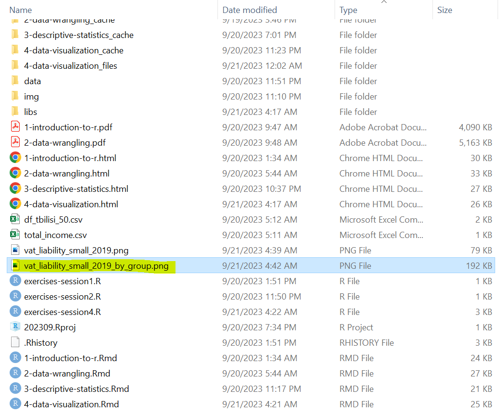
```

---

# Gráficos de linha

Escolher a codificação correta para seus dados pode ser complicado. Depende do que você quer mostrar em seu gráfico e quanta informação você quer que ele mostre

  + **Gráficos de barras** mostram menos informações que gráficos de linha em geral, mas são bons para casos em que você tem apenas uma variável numérica e uma variável categórica para mostrar
  + **Gráficos de linha** podem mostrar mais informações e incluir múltiplos grupos para adicionar uma dimensão adicional aos seus dados, mas não são visualmente atraentes quando seus dados variam muito de uma categoria para outra

.pull-left[
```{r echo=FALSE, out.width="100%"}
ggplot(base_nfe) +
  aes(x = as.factor(mes_emissao),
      y = vicms) +
  geom_col() +
  labs(title = "Total de ICMS por mês",
       x = "Mês",
       y = "Valor ICMS (R$)") +
  scale_x_discrete(labels = c("Outubro", "Novembro", "Dezembro")) +
  theme(plot.title = element_text(hjust = 0.5)) + 
  theme_classic()
```
]

.pull-right[
```{r echo=FALSE, out.width="100%"}
ggplot(df_group_month) +
  aes(x = mes_emissao,
      y = total) +
  geom_line(aes(color = as.factor(emitcnpj8_anon))) +
  labs(title = "Total de ICMS por grupo de empresas em 2019",
       x = "Mês",
       y = "ICMS (R$)") +
  scale_x_continuous(breaks = c(10,11,12)) +
  theme(plot.title = element_text(hjust = 0.5)) + 
  theme_classic()
```
]

---

class: inverse, center, middle
name: text-encodings

# Codificações de texto

<html><div style='float:left'></div><hr color='#D38C28' size=1px width=1100px></html>

---

# Codificações de texto

- Formas geométricas como barras e linhas não são a única maneira de codificar dados em gráficos

- Também podemos usar texto diretamente para representar informações no gráfico, como no exemplo abaixo. Isso é chamado de **codificações de texto**

- Codificações de texto podem ser combinadas com codificações geométricas para destacar informações ou fornecer detalhes importantes adicionais à sua visualização

```{r echo=FALSE}
df_mes <- base_nfe %>%
  select(mes_emissao, vicms) %>%
  group_by(mes_emissao) %>%
  summarize(total = sum(vicms))
```

```{r echo=FALSE, out.width="57%"}
ggplot(df_mes) +
  aes(x = mes_emissao,
      y = total) +
  geom_col() +
  geom_text(aes(label = total),
            position = position_dodge(width = 1),
            vjust = -0.5,
            size = 3) +
  labs(title = "Total de ICMS por mês",
       x = "Mês",
       y = "ICMS (R$)") +
  theme(plot.title = element_text(hjust = 0.5)) + 
  theme_classic()
```

---

# Codificações de texto

- Usar codificações de texto em gráfico de barras pode ser esclarecedor

- No entanto, também requer manipulação adicional de dados: os dados precisam ser agrupados no mesmo nível do eixo x para poder adicionar codificações

- Veremos isso no próximo exercício

```{r echo=FALSE, out.width="57%"}
ggplot(df_mes) +
  aes(x = mes_emissao,
      y = total) +
  geom_col() +
  geom_text(aes(label = total),
            position = position_dodge(width = 1),
            vjust = -0.5,
            size = 3) +
  labs(title = "Total de ICMS por mês",
       x = "Mês",
       y = "ICMS (R$)") +
  theme(plot.title = element_text(hjust = 0.5)) + 
  theme_classic()
```

---
# Codificações de texto
## Exercício 3a: Agrupe seus dados no nível mensal

Isso é similar ao que fizemos no exercício 2a, exceto que desta vez o agrupamento é no nível mensal em vez do nível mês-grupo. Use o código abaixo para armazenar o dataframe agrupado em `df_mes`

```{r eval=FALSE}
df_mes <- base_nfe %>%
  select(mes_emissao, vicms) %>%
  group_by(mes_emissao) %>%
  summarize(total = sum(vicms))
```

---
# Codificações de texto

Esse deve ser o resultado que você pode ver usando `View(df_mes)`

```{r echo = FALSE, out.width="50%"}
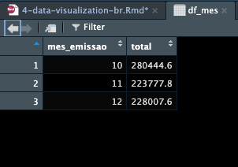
```


---
# Codificações de texto

## Exercício 3b: Adicione codificações ao seu gráfico de barras

Use o dataframe agrupado `df_mes` e o código anterior do exercício 1 para adicionar codificações ao seu gráfico de barras. O resultado é o código abaixo:

```{r eval=FALSE}
ggplot(df_mes) +
  aes(x = mes_emissao,
      y = total) +
  geom_col() +
  geom_text(aes(label = total),
            position = position_dodge(width = 1),
            vjust = -0.5,
            size = 3) +
  labs(title = "Total de ICMS por mês",
       x = "Mês",
       y = "ICMS (R$)") +
  theme_classic() + 
  theme(plot.title = element_text(hjust = 0.5)) 
  
```

---

# Codificações de texto

Este resultado é bom, mas as codificações de texto têm várias casas decimais. Podemos melhorá-lo arredondando `total` com a função `round()`

```{r echo = FALSE, out.width="75%"}
ggplot(df_mes) +
  aes(x = mes_emissao,
      y = total) +
  geom_col() +
  geom_text(aes(label = total),
            position = position_dodge(width = 1),
            vjust = -0.5,
            size = 3) +
  labs(title = "Total de ICMS por mês",
       x = "Mês",
       y = "ICMS (R$)") +
  theme_classic() + 
  theme(plot.title = element_text(hjust = 0.5)) 
  
```

---
# Codificações de texto
## Exercício 3c: Melhore seu gráfico mais uma vez

Substitua `total` por `round(total)` em `geom_text()`. O resultado deve ser:

```{r eval=FALSE}
ggplot(df_mes) +
  aes(x = mes_emissao,
      y = total) +
  geom_col() +
  geom_text(aes(label = round(total)),        #<- Mudança vai aqui
            position = position_dodge(width = 1),
            vjust = -0.5,
            size = 3) +
  labs(title = "Total de ICMS por mês",
       x = "Mês",
       y = "ICMS (R$)") +
  scale_x_continuous(breaks = 201901:201912) +
  theme(plot.title = element_text(hjust = 0.5)) + 
  theme_classic()
```

---
# Codificações de texto

```{r echo=FALSE, out.width="75%"}
ggplot(df_mes) +
  aes(x = mes_emissao,
      y = total) +
  geom_col() +
  geom_text(aes(label = round(total)),        #<- Mudança vai aqui
            position = position_dodge(width = 1),
            vjust = -0.5,
            size = 3) +
  labs(title = "Total de ICMS por mês",
       x = "Mês",
       y = "ICMS (R$)") +
  scale_x_continuous(breaks = 201901:201912) +
  theme(plot.title = element_text(hjust = 0.5)) + 
  theme_classic()
```
---
# Codificações de texto

## Não se esqueça de salvar seu gráfico!

Use este código para salvar este último gráfico:

```{r eval=FALSE}
ggsave("nfe_totals_text.png",
       width = 20,
       height = 10,
       units = "cm")
```

---

class: inverse, center, middle
name: scatter-plots

# Gráficos de dispersão

<html><div style='float:left'></div><hr color='#D38C28' size=1px width=1100px></html>

---

# Gráficos de dispersão

- Vamos explorar mais um tipo de codificação para visualizações de dados: **gráficos de dispersão** (*scatter plot*)

- Gráficos de dispersão são úteis quando você tem duas variáveis numéricas contínuas e quer mostrar que pode haver uma correlação entre elas ou visualizar outliers (valores que se destacam do resto porque são muito extremos)

- Usamos a codificação `geom_point()` para gráficos de dispersão

```{r echo=FALSE, out.width="55%"}
ggplot(base_nfe) +
  aes(x = vprod,
      y = vicms) +
  geom_point() +
  labs(title = "ICMS vs. valor produto",
       x = "Valor Produto (R$)",
       y = "Valor ICMS (R$)") +
  theme(plot.title = element_text(hjust = 0.5)) + 
  theme_classic()
```
---
# Gráficos de dispersão
## Exercício 4: Criar um gráfico de dispersão

Use o seguinte código para reproduzir o gráfico de dispersão do último slide:

```{r eval=FALSE}
ggplot(base_nfe) +
  aes(x = vprod,
      y = vicms) +
  geom_point() +
  labs(title = "ICMS vs. valor produto",
       x = "Valor Produto (R$)",
       y = "Valor ICMS (R$)") +
  theme(plot.title = element_text(hjust = 0.5)) + 
  theme_classic()
```

---
# Gráficos de dispersão

```{r echo=FALSE, out.width="85%"}
ggplot(base_nfe) +
  aes(x = vprod,
      y = vicms) +
  geom_point() +
  labs(title = "ICMS vs. valor produto",
       x = "Valor Produto (R$)",
       y = "Valor ICMS (R$)") +
  theme(plot.title = element_text(hjust = 0.5)) + 
  theme_classic()
```

---
# Gráficos de dispersão

Por último, lembre-se de salvar seu gráfico de dispersão com:

```{r eval=FALSE}
ggsave("scatter_vprod_icms.png",
       width = 20,
       height = 10,
       units = "cm")
```

---

class: inverse, center, middle
name: wrapping-up

# Conclusão

<html><div style='float:left'></div><hr color='#D38C28' size=1px width=1100px></html>

---

# Conclusão

## Outras codificações no `ggplot2`

Esta tabela lista várias das codificações mais populares no `ggplot2`

| Codificação | Função no `ggplot2` |
| -------- | --------------------- |
| Barras | `geom_col()` |
| Linhas | `geom_line()` |
| Pontos (gráfico de dispersão) | `geom_point()` |
| Área | `geom_area()` |
| Histograma | `geom_histogram()` |
| Etiquetas flutuantes (textos) | `geom_text()` |
| Box plot | `geom_boxplot()` |
| Gráfico de pizza | `geom_bar() + coord_polar()` |
| Linha suavizada | `geom_smooth()` |

---

# Conclusão

## Salve seu código!

Clique no disquete para salvar seu código em um local que você lembrará.

```{r echo = FALSE, out.width="55%"}
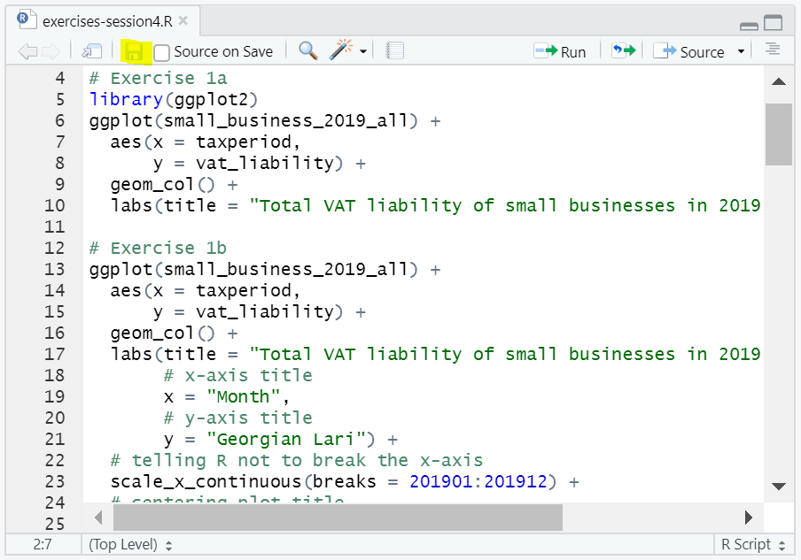
```

---

# Conclusão

## Pipeline de trabalho com dados

```{r echo = FALSE, out.width="95%"}
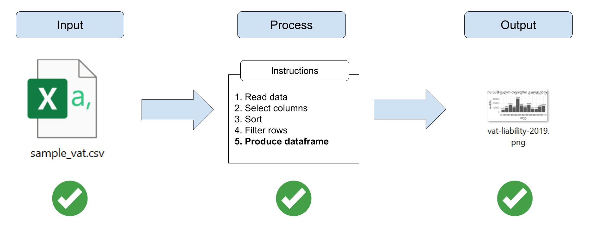
```

---

# Conclusão

## Olhando adiante

```{r echo = FALSE, out.width="95%"}
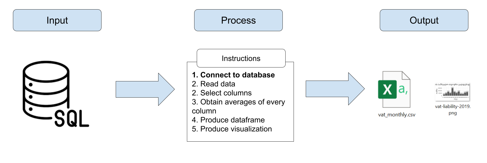
```

---

# Conclusão

## Olhando adiante

- [Conectando R com bancos de dados SQL](https://solutions.posit.co/connections/db/getting-started/connect-to-database/). Algumas bibliotecas:
  + `dbConnect`
  + `dbplyr`
  + `DBI`

- [Mais sobre manipulação de dados](https://raw.githack.com/worldbank/dime-r-training/main/Presentations/03-data-wrangling.html#1). Mais bibliotecas:
  + `tidyr`
  + `janitor`
  + `data.table`

- [Mais sobre visualização de dados](https://raw.githack.com/worldbank/dime-r-training/main/Presentations/04-data-visualization.html#1)

---

class: inverse, center, middle

# Obrigado!

<html><div style='float:left'></div><hr color='#D38C28' size=1px width=1100px></html>
